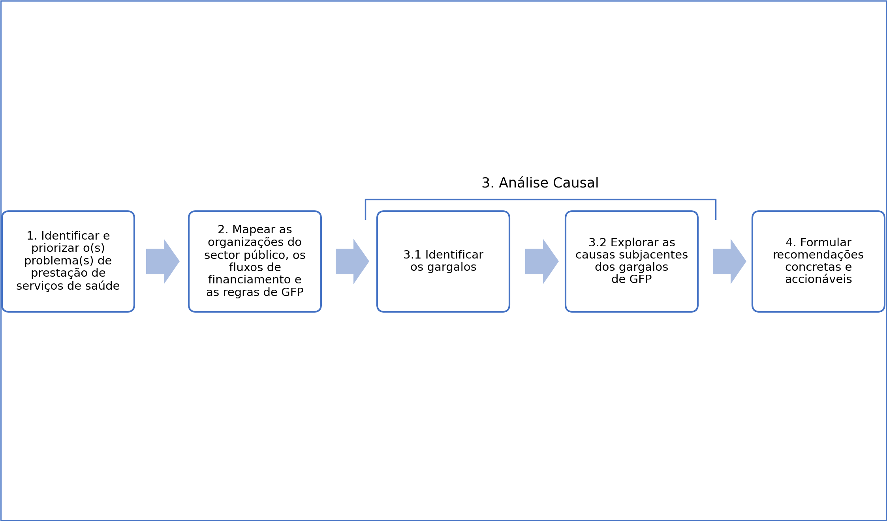
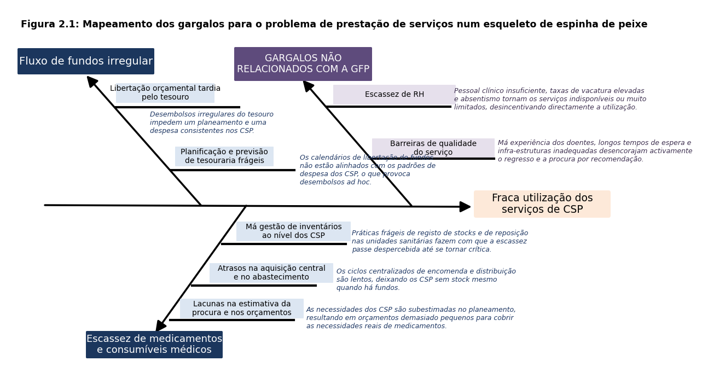

Figura 2.1 Processo FinHealth

{fig-align="center"}

*Fonte:* *Autores.*

O Kit de Ferramentas define quatro etapas para a realização de uma avaliação FinHealth (figura 2.1). São elas: (i) identificar e priorizar os problemas de [prestação de serviços de saúde](../glossario.qmd#g-prestacao-de-servicos-de-saude) que serão o foco da análise subsequente; (ii) mapear as organizações do sector público, os fluxos de financiamento e as regras de GFP relacionados com os problemas de [prestação de serviços](../glossario.qmd#g-prestacao-de-servicos) de saúde seleccionados; (iii) realizar a [análise causal](../glossario.qmd#g-analise-causal), identificando os gargalos na base dos problemas seleccionados e examinando a [causa subjacente](../glossario.qmd#g-causa-subjacente) dos gargalos de GFP; e (iv) sendo o FinHealth orientado para a acção, elaborar uma lista priorizada de recomendações para resolver os gargalos de GFP associados aos problemas seleccionados (caixa 2.1). Embora as etapas sejam aqui apresentadas de forma linear, na prática o processo tende a ser iterativo, com as equipas a utilizarem cada tarefa para aperfeiçoar as restantes.

::: {.callout-note title="Caixa 2.1: Visualizar a Análise dos Problemas de Prestação de Serviços de Saúde, dos Gargalos e das Causas Subjacentes"}

As Etapas 1 a 3 do Kit de Ferramentas contribuem para a análise, que ilustra as ligações entre o(s) problema(s) de prestação de serviços de saúde seleccionado(s), os gargalos de GFP e as causas subjacentes que para eles contribuem. O FH adopta o «diagrama de espinha de peixe» como instrumento para visualizar a análise. A figura 2.2 mostra um exemplo deste diagrama. O [problema de prestação de serviços de saúde](../glossario.qmd#g-problema-de-prestacao-de-servicos-de-saude) seleccionado aparece na cabeça (a laranja na figura abaixo), com os gargalos identificados (a azul) e as causas subjacentes (a amarelo) nas espinhas. A figura é acompanhada de um breve relatório que permite uma descrição mais pormenorizada dos gargalos e das causas identificados, que podem ser inseridos no diagrama.

Figura 2.2: Mapeamento dos Problemas de Prestação de Serviços de Saúde para os Gargalos de GFP e as Causas Subjacentes num Diagrama de Espinha de Peixe.

{fig-align="center"}

*Fonte:* *Autores.*

*Nota:* Embora o kit de ferramentas FH 2.0 se refira à utilização de um diagrama de espinha de peixe, as equipas de diagnóstico podem utilizar outro tipo de diagrama para ilustrar a análise causal. Seja qual for a figura escolhida pela equipa, recomenda-se incluir um elemento visual que mapeie a análise causal.

:::

## Identificação do(s) Problema(s) de Prestação de Serviços de Saúde {#sec-2-1}

- Objectivo: Identificar 3 a 5 problemas de prestação de serviços de saúde que sirvam de foco ao diagnóstico. Definir cada problema em termos do que não está a funcionar, porque é que isso importa e onde ocorre. Os problemas devem descrever falhas, e não as suas causas. A equipa preenche a «cabeça» do(s) seu(s) diagrama(s) de espinha de peixe com o(s) problema(s) de prestação de serviços de saúde identificado(s).

O FinHealth parte dos sistemas de saúde, e não dos sistemas de GFP. A equipa de análise começa por perguntar o que não está a funcionar na prestação de serviços de saúde e passa depois a identificar as formas como os gargalos de GFP contribuem para esses problemas. Centrar a análise em problemas específicos de prestação de serviços de saúde mantém o diagnóstico ancorado no objectivo de melhorar o desempenho do sector. Evita também que a análise se transforme num inventário amplo das fragilidades do sistema de GFP.

Os problemas de prestação de serviços de saúde impedem as pessoas de alcançar o mais elevado nível de saúde possível. Os serviços de saúde são o conjunto de actividades, intervenções e funções de apoio prestadas pelos sistemas de saúde para manter, melhorar ou restabelecer a saúde das pessoas. Incluem a promoção, a prevenção, o diagnóstico, o tratamento, a reabilitação e os cuidados paliativos, prestados nos diferentes níveis do sistema (comunidade, cuidados primários, hospitais, serviços especializados) (adaptado de OMS 2000). Um problema de prestação de serviços de saúde define-se como lacunas, deficiências ou desigualdades na disponibilidade, acessibilidade, qualidade ou segurança dos cuidados de saúde que impedem as pessoas de receber os cuidados de que necessitam.

Os problemas de prestação de serviços de saúde não são gargalos de GFP nem resultados em saúde (ver caixa 2.2). Uma dificuldade comum enfrentada pelas equipas de análise do FH 1.0 foi a de os enunciados dos problemas se centrarem em desafios de GFP (demasiado «baixos») ou se situarem ao nível dos resultados em saúde (demasiado «altos»). Um problema descreve o que não está a funcionar na prestação de serviços de saúde, ao passo que um gargalo explica porque é que esse problema acontece. Um resultado é o efeito que um problema de prestação de serviços de saúde pode ter sobre a saúde e o bem-estar. Um problema de prestação de serviços de saúde situa-se ao nível do produto, isto é, dos produtos ou serviços directos entregues por um sistema de saúde, como o número de vacinações administradas ou de camas hospitalares ocupadas.

::: {.callout-note title="Caixa 2.2: Guia Rápido para Determinar a Natureza do Problema: Questão de Prestação de Serviços de Saúde, Gargalo de GFP ou Resultado em Saúde"}

Como referido, um problema descreve o que não está a funcionar na prestação de serviços ou na utilização de recursos. Pelo contrário, um gargalo explica porque é que esse problema acontece. As equipas devem manter esta distinção clara para evitar que a análise salte directamente para as fragilidades do sistema antes de estabelecer o que precisa de ser corrigido. Quando as equipas passam demasiado depressa ao «porquê», o diagnóstico corre o risco de se centrar no sistema, produzindo longas listas de fragilidades na orçamentação, nos RH ou na [contratação pública](../glossario.qmd#g-contratacao-publica) — sem as ligar a lacunas reais de prestação (os problemas de prestação de serviços de saúde). Quando as partes interessadas descrevem gargalos (por exemplo, «a contratação pública é lenta»), as equipas devem aprofundar para identificar o problema daí resultante («os medicamentos essenciais chegam tarde às unidades sanitárias»). Isto ajuda a traduzir afirmações genéricas («os cuidados primários são fracos») em questões observáveis («as unidades sanitárias não têm parteiras» ou «os doentes contornam os centros de saúde e vão directamente aos hospitais»)

Para determinar se uma afirmação descreve um problema ou um gargalo, aplique estas perguntas:

Descreve o que não está a funcionar (uma lacuna ou ineficiência no serviço)? É um problema.

Explica porque é que essa questão ocorre (um constrangimento de processo, de regra ou do sistema)? É um gargalo.

Exemplos de problemas vs. gargalos

| Problema (o que não está a funcionar) | Gargalo (porque é que acontece) |
|:--|:--|
| As unidades sanitárias não conseguem recrutar nem reter pessoal qualificado. | O recrutamento centralizado e regras salariais rígidas limitam a flexibilidade ao nível da unidade sanitária. |
| Os consumíveis médicos esgotam-se ou chegam tarde com frequência. | Os atrasos na contratação pública e na libertação de fundos impedem a reposição atempada. |
| Os centros de saúde rurais são mal servidos em comparação com as zonas urbanas. | As fórmulas de alocação de recursos estão desactualizadas ou são negociadas politicamente. |
| Os serviços de rotina são interrompidos durante as crises. | A ausência de fundos de contingência e regras orçamentais rígidas limitam a realocação durante as emergências. |

Como referido, um resultado em saúde é o efeito de actividades ou intervenções sobre a saúde e o bem-estar. São exemplos de resultados a redução das taxas de mortalidade, a melhoria da qualidade de vida ou o controlo bem-sucedido de uma doença crónica. Embora a melhoria dos resultados seja o objectivo último do FH, estes resultados situam-se a um nível demasiado alto para servirem de enunciados de problemas para a análise. Se a equipa de análise iniciar a identificação de problemas ao nível dos resultados, pode aprofundar perguntando porque é que esses resultados são baixos. Pode também fazer emergir problemas de prestação de serviços de saúde, como a distribuição desigual de centros de saúde, a dificuldade em atrair e reter pessoal, ou a escassez de medicamentos ou de equipamento, que devem então ser o ponto de entrada da avaliação FH

Para verificar se uma afirmação descreve um problema ou um resultado em saúde, aplique estas perguntas:

Diz respeito a produtos ou serviços directos entregues por um sistema de saúde, como o número de vacinações administradas ou de camas hospitalares ocupadas? Trata-se de medidas quantificáveis de esforço e de utilização de recursos? Se sim, é um produto, actividade ou intervenção.

Diz respeito ao efeito de actividades ou intervenções sobre a saúde e o bem-estar? Se sim, é um resultado.

Exemplos de resultados vs. produtos:

| Resultado | Produto | Insumo |
|:--|:--|:--|
| Taxas de infecção e de mortalidade por malária | Disponibilidade de redes mosquiteiras tratadas com insecticida | Alocação financeira |
| Taxa de recém-nascidos com baixo peso à nascença | Distribuição de kits de vitaminas pré-natais | Distribuição dos RH |
| Tempo médio de resposta a chamadas por risco de vida | Disponibilidade de ambulâncias | Medicamentos e equipamento |

:::

*Fonte:* Autores.

Os quadros analíticos existentes sobre a prestação de serviços podem ser utilizados para identificar, estruturar e validar problemas prementes de prestação de serviços de saúde. O FinHealth não está vinculado a nenhum quadro analítico específico. A caixa 2.3 apresenta exemplos de quadros disponíveis na literatura, que podem ser utilizados para assegurar a exaustividade da análise. Quando disponíveis, os utilizadores do FH devem recorrer a análises e informação existentes, em vez de nova recolha de dados, na identificação dos problemas de prestação de serviços de saúde.

Quando forem identificados vários problemas de prestação de serviços de saúde, os analistas devem priorizá-los e concentrar-se num número limitado, de modo a permitir uma análise aprofundada e a identificação de acções concretas para os resolver. Os diagnósticos devem centrar-se em pelo menos um — e não mais de cinco — problemas de prestação de serviços de saúde. Os critérios de selecção podem incluir os problemas considerados mais prementes do ponto de vista dos resultados em saúde, aqueles para os quais existe uma janela de oportunidade para a reforma, bem como o potencial contributo dos constrangimentos de GFP. Alguns problemas podem ter poucos ou nenhuns factores de GFP, enquanto outros estarão mais facilmente ligados à GFP. As áreas prioritárias identificadas devem ser acordadas com as principais contrapartes interessadas, incluindo do Ministério da Saúde e do Ministério das Finanças.

Esta primeira etapa do FH resulta na formulação de enunciados de problemas claros e específicos, ao nível dos serviços, que descrevam o que não está a funcionar; porque é que isso importa; e onde ocorre. O enunciado do problema deve centrar-se no que não está a funcionar na alocação e utilização de recursos ao nível dos serviços. Deve mostrar a ligação aos resultados em saúde e deixar claro em que ponto do sistema de saúde o problema ocorre. Por exemplo, «os medicamentos essenciais não chegam atempadamente às unidades sanitárias primárias, apesar de estarem orçamentados, o que provoca interrupções do tratamento» ou «durante as crises, os serviços de rotina são interrompidos e as respostas de emergência atrasam-se, causando mortes evitáveis e surtos prolongados.»

Caixa 2*.3*: Quadros analíticos disponíveis na literatura para ajudar a identificar problemas de prestação de serviços

- Quadro de Análise de Gargalos da Oferta e da Procura (Supply-demand Bottleneck Analysis Framework). Um quadro simples e amplamente utilizado que avalia os gargalos do lado da oferta (força de trabalho, produtos, infra-estruturas e fluxos de financiamento) e do lado da procura (acesso, capacidade financeira, aceitabilidade) na prestação de serviços. [^2]
- Quadro de Disponibilidade, Acessibilidade, Aceitabilidade e Qualidade (AAAQ). Um quadro amplamente utilizado entre os profissionais de saúde, em particular os que trabalham em contextos humanitários e em crises prolongadas. Derivado do modelo de Tanahashi, o quadro está fortemente alinhado com as abordagens à prestação de serviços de saúde baseadas nos direitos humanos.[^3]
- Avaliação da Disponibilidade e Prontidão dos Serviços (SARA). A SARA é um instrumento de avaliação das unidades sanitárias concebido para avaliar e monitorar a disponibilidade e a prontidão dos serviços do sector da saúde. É utilizada para gerar evidência de apoio ao planeamento e à gestão de um sistema de saúde.[^4]
- Revisões de Programas de Saúde. A utilização de análises e informação provenientes das revisões de programas de saúde pode ajudar a identificar a natureza dos problemas de prestação de serviços de saúde. Fonte: Autores.[^5]

## Mapeamento das Organizações do Sector Público, dos Fluxos de Financiamento e das Regras de GFP Relevantes para o(s) Problema(s) de Prestação de Serviços de Saúde Seleccionado(s) {#sec-2-2}

- Objectivo: Mapear as organizações, os fluxos de financiamento e as regras de GFP relevantes para o(s) problema(s) de prestação de serviços de saúde seleccionado(s). Para o(s) problema(s) seleccionado(s), identificar as organizações relevantes do sistema de saúde, mapear a forma como os recursos circulam no sistema e documentar as regras de GFP que regem esses fluxos.

Uma vez identificados os principais problemas de prestação de serviços de saúde, a tarefa seguinte consiste em realizar um mapeamento contextual básico, identificando as organizações do sector público relevantes no sistema de saúde, traçando o percurso dos recursos através do sistema e mapeando os processos de GFP que regem esses fluxos. Esta etapa visa fornecer o contexto essencial que informa a análise causal subsequente dos gargalos de GFP e das suas causas subjacentes. O mapeamento deve incluir todas as organizações, fluxos de fundos e aspectos de GFP relevantes para o(s) problema(s) identificado(s) para análise. Nesta etapa, a equipa de análise deve consultar as orientações detalhadas sobre o processo apresentadas no anexo 1. A tabela 2.1 apresenta um resumo de cada tarefa.

Tabela 2.1: Exercício de Caracterização do Sistema de Saúde e do seu Financiamento

| Identificar as Organizações | Classificar as Organizações | Mapear os fluxos de financiamento | Mapear as regras de GFP |
|:--|:--|:--|:--|
| Enumerar as organizações do sector envolvidas na prestação de serviços de saúde financiados com recursos públicos, incluindo: Órgãos de definição de políticas (por exemplo, Ministério da Saúde) Gestores de fundos (por exemplo, Ministério das Finanças, Ministério da Saúde, fundos de seguro ou outras agências de compra autónomas, governos locais) Prestadores de serviços (por exemplo, hospitais, centros de saúde, organizações não governamentais, ONG) Agências de apoio e de supervisão (por exemplo, serviços de auditoria) Porque é que importa: Define o âmbito do sistema de saúde, para assegurar que todas as instituições relevantes são abrangidas e que nenhum actor importante é omitido. | Caracterizar cada organização do sector segundo três atributos: Estatuto orçamental: se opera dentro do orçamento do Governo ou como entidade extraorçamental Nível de governo: se é gerida ao nível nacional ou subnacional Fonte de financiamento: se é financiada por dotações orçamentais, seguro social de saúde, fundos de doadores ou taxas moderadoras Porque é que importa: A classificação mostra porque é que instituições com funções semelhantes podem estar sujeitas a regras de GFP muito diferentes. Produto: Uma matriz de classificação que mostra os atributos de governação e as principais fontes de financiamento de cada instituição. | Traçar a forma como os fundos públicos circulam entre: Gestores de fundos (por exemplo, departamentos, fundos de seguro, etc.) Intermediários (por exemplo, governo local) Utilizadores finais (por exemplo, unidades executoras, centros de saúde, hospitais) Resumir depois o ambiente de regras que rege cada via principal (por exemplo, tesouraria, extraorçamental, doadores ou outra). Porque é que importa: Mostra como os fundos circulam através de diferentes sistemas de controlo Produto: Um diagrama de fluxos que ilustra as principais vias de financiamento e um resumo dos ambientes de regras de cada fonte de financiamento. | Para cada via de financiamento principal, resumir a forma como os fundos são regidos e libertados: Como são alocados os fundos públicos? Quem controla os fundos e autoriza a sua libertação? Como são os fundos transferidos entre níveis de governo? Como recebem e gastam os fundos os prestadores (os chamados mecanismos e tarifas de pagamento a prestadores)? Que regras ou mecanismos de supervisão regem estes fluxos? Como são os fundos contabilizados e reportados? Porque é que importa: Traz clareza sobre as regras e os processos relacionados com os fluxos de fundos e fornece a base para que o analista identifique os gargalos relacionados com a GFP Produto: Descrição dos principais processos de GFP relacionados com as entidades e os fluxos de fundos relevantes. |

*Fonte:* Autores.

As equipas produzirão dois produtos: (i) uma matriz estruturada das organizações do sector, na sua relação com o(s) problema(s) de prestação de serviços de saúde identificado(s); e (ii) um mapa que mostra como os fundos relacionados com o(s) problema(s) de prestação de serviços de saúde circulam no sistema. As equipas começam por identificar as principais categorias de organizações do sector público no sistema de saúde que recebem e utilizam fundos públicos. Cada organização é depois caracterizada segundo os atributos de governação (nacional ou subnacional, orçamental ou extraorçamental) e a fonte de financiamento. Estes atributos captam as principais dimensões que determinam quais as regras de GFP aplicáveis. Por fim, os fluxos de financiamento e as regras de GFP que regem esses fundos e a sua libertação são traçados desde as fontes, passando por eventuais intermediários (por exemplo, uma agência nacional de compra), até às entidades que efectuam a despesa final (por exemplo, um centro de saúde). A secção deve também detalhar quais as regras e os processos que se aplicam à gestão dos fluxos de financiamento. A evidência existente deve ser aproveitada para informar este exercício de mapeamento, incluindo as constatações de avaliações realizadas com a Health Financing Progress Matrix da OMS, as Financing Assessment Tools do Banco Mundial e as Revisões da Despesa Pública do Banco Mundial.

Este exercício ilustra a natureza dinâmica do sistema de saúde e fornece a base para a análise subsequente dos gargalos de GFP. Os fundos circulam por várias camadas e as instituições podem, muitas vezes, actuar simultaneamente como beneficiárias e como pagadoras. Caracterizar as instituições e mapear os fluxos em conjunto torna estas relações visíveis, por exemplo, ao mostrar como um fundo de seguro pode receber subsídios do Governo e outras contribuições, que depois paga aos prestadores como receita. Quando o problema em análise está relacionado com a força de trabalho da saúde, o mapeamento incluirá a forma como os trabalhadores são financiados, bem como as responsabilidades organizacionais pela fixação dos salários, pelo recrutamento e colocação e pelo pagamento. Quando pertinente, os analistas podem incorporar estas componentes na análise, aplicando a mesma lógica e as mesmas etapas acima descritas.

O mapeamento do financiamento diz respeito, sobretudo, aos recursos domésticos; contudo, deve também captar os fluxos de [financiamento externo](../glossario.qmd#g-financiamento-externo), quando pertinente. Em contextos em que a ajuda representa uma parte importante do [financiamento da saúde](../glossario.qmd#g-financiamento-da-saude), é essencial identificar as principais fontes externas, estimar o seu volume e documentar os seus canais, os principais beneficiários e as modalidades de despesa. Por exemplo, em muitos países de baixo rendimento, a assistência externa continua a circular fora dos sistemas regulares de GFP, o que pode criar gargalos adicionais para o financiamento e a prestação de serviços de saúde. Estes fundos seguem muitas vezes requisitos próprios de alocação, gestão e reporte, o que pode fragmentar o panorama do financiamento, reduzir a previsibilidade e aumentar a carga administrativa sobre as instituições nacionais e os prestadores de serviços. Por isso, um mapeamento abrangente que integre os fluxos domésticos e externos dará uma imagem mais clara da arquitectura global do financiamento. Ajudará também a identificar oportunidades para melhorar o alinhamento, a eficiência e a coerência entre fontes de financiamento.

## Análise Causal: Identificação dos Gargalos e das suas Causas Subjacentes {#sec-2-3}

- Objectivo: Identificar os gargalos de fundo e determinar as causas subjacentes de GFP. Explorar as causas subjacentes dos gargalos de GFP e as razões da sua persistência. A equipa de análise preenche a espinha de peixe com os gargalos e as causas subjacentes de GFP identificados.

A análise causal identifica os gargalos de GFP e explora as suas causas subjacentes. Um gargalo de GFP define-se como uma regra ou prática de GFP que constitui uma causa significativa do(s) problema(s) de prestação de serviços de saúde seleccionado(s). Isto significa que nem todo o desvio em relação às boas práticas de GFP constituirá um gargalo de GFP na análise FH. Quando for identificada uma lista extensa de gargalos de GFP, pode ser necessário priorizá-los para manter o âmbito gerível. Nesse caso, o analista deve concentrar-se nos gargalos de GFP com maior efeito previsto sobre o problema de prestação de serviços de saúde. Em seguida, o analista deve explorar as causas subjacentes desses gargalos, por exemplo, as razões específicas pelas quais existem e persistem. No final da análise causal, a equipa de análise terá preenchido o seu diagrama de espinha de peixe com os gargalos e as respectivas causas subjacentes.

A análise causal liga os gargalos de GFP aos problemas de prestação de serviços de saúde. A título de exemplo, «planeamento e orçamentação inadequados» pode ser identificado como um gargalo de GFP para o problema «as unidades sanitárias não dispõem de pessoal adequado». Isto acontece quando o Governo não prevê com exactidão quantos profissionais de saúde são necessários, com que nível de qualificação e quanto poderá custar empregá-los. Daí resulta um orçamento alocado ao pessoal de saúde insuficiente ou desajustado. As unidades sanitárias ficam então impossibilitadas de preencher os lugares, porque não existe orçamento aprovado para os remunerar. Embora possam existir outros factores na origem deste problema, um constrangimento-chave é a falta de autorização financeira para contratar e remunerar os profissionais de saúde.

A análise causal pode reconhecer o papel de gargalos que não são de GFP; contudo, não os explora em profundidade. Não cabe ao FinHealth identificar todos os constrangimentos não relacionados com a GFP que contribuem para os problemas de prestação de serviços de saúde identificados, nem explorar as causas subjacentes desses constrangimentos. No entanto, a equipa de análise pode optar por documentar os constrangimentos não relacionados com a GFP que surjam durante as entrevistas, as consultas e a revisão de avaliações existentes. Estes podem ser utilizados para contextualizar a avaliação, evidenciando em que medida são necessárias medidas complementares, não relacionadas com a GFP, para resolver os problemas de prestação de serviços de saúde identificados.

O FinHealth fornece orientações para apoiar as equipas na ligação dos problemas de prestação de serviços de saúde aos gargalos de GFP associados. O Capítulo 3 apresenta uma visão detalhada dos problemas de saúde comuns, dos gargalos de GFP frequentemente associados e das respectivas causas subjacentes. A tabela 2.2, abaixo, resume o Capítulo 3 e pode ser utilizada como ponto de partida para a identificação dos gargalos. Para tal, localizam-se os problemas de saúde seleccionados na coluna da esquerda, percorrem-se os gargalos associados na coluna da direita (com hiperligações para a secção relevante do Capítulo 3) e avalia-se a sua relevância no contexto do país. Além disso, o Anexo 3 oferece uma descrição mais pormenorizada das vias potenciais que explicam porque é que o gargalo de GFP pode ser relevante e como afecta o problema de prestação de serviços de saúde (conforme as hiperligações na tabela).

A lista de exemplos de problemas e gargalos apresentada no FinHealth não pretende ser exaustiva. Além disso, o FinHealth não pretende ser abrangente. Alguns problemas, gargalos ou causas subjacentes podem não estar contemplados, e algum do conteúdo disponível pode não ser relevante para o contexto do país. O analista é encorajado a recorrer ao material disponível. Contudo, deve formular um juízo sobre a sua relevância e complementá-lo, conforme necessário, com uma análise de dados mais aprofundada e entrevistas às partes interessadas.

Tabela 2.2: Resumo dos Problemas de Prestação de Serviços de Saúde e dos Potenciais Gargalos de GFP a Explorar

| Exemplos de Problemas de Prestação de Serviços de Saúde | Potenciais Gargalos de GFP a Explorar |
|:--|:--|
| As unidades sanitárias não dispõem de pessoal adequado. As unidades sanitárias podem não conseguir recrutar ou reter pessoal com qualificações adequadas, o que afecta negativamente tanto o acesso aos serviços como a sua qualidade. | - Planeamento e orçamentação inadequados do emprego público e das remunerações ([3.1.7](03-gargalos.qmd#sec-3-1-7)); - Execução orçamental frágil no emprego público([3.2.7](03-gargalos.qmd#sec-3-2-7)); - Não aplicação de modelos de financiamento baseados em fórmula entre níveis de governo ([3.4.4](03-gargalos.qmd#sec-3-4-4)). |
| A produtividade do pessoal é baixa. O pessoal pode estar insuficientemente incentivado, faltar frequentemente ou exercer actividade paralela no sector privado. É provável que isto afecte a eficiência e a qualidade dos serviços. | - Planeamento e orçamentação inadequados do emprego público e das remunerações ([3.1.7](03-gargalos.qmd#sec-3-1-7)); - Falta de credibilidade orçamental ([3.1.5](03-gargalos.qmd#sec-3-1-5)); - Dificuldades no fluxo de fundos ([3.2.1](03-gargalos.qmd#sec-3-2-1)); - Execução orçamental frágil no emprego público ([3.2.7](03-gargalos.qmd#sec-3-2-7)); - Monitoria e avaliação de resultados ausentes ou frágeis ([3.3.2](03-gargalos.qmd#sec-3-3-2)). |
| A remuneração é injustificada, o que gera perdas de eficiência. Os pagamentos a trabalhadores fantasma ou os pagamentos de incentivos indevidos podem passar sem controlo, resultando em remunerações injustificadas e perdas de eficiência. | - Escrutínio inadequado da despesa ([3.1.2](03-gargalos.qmd#sec-3-1-2)); - Planeamento e orçamentação inadequados do emprego público e das remunerações ([3.1.7](03-gargalos.qmd#sec-3-1-7)); - Controlos frágeis da execução orçamental ([3.2.2](03-gargalos.qmd#sec-3-2-2)); - Execução orçamental frágil no emprego público ([3.2.7](03-gargalos.qmd#sec-3-2-7)). |
| Falta equipamento médico. A indisponibilidade de equipamento médico ou de consumíveis adequados afectará a qualidade dos serviços e o acesso a eles. | - Fraca integração entre planeamento e orçamentação ([3.1.1](03-gargalos.qmd#sec-3-1-1)); - Falta de credibilidade orçamental ([3.1.5](03-gargalos.qmd#sec-3-1-5)), - Dificuldades no fluxo de fundos ([3.2.1](03-gargalos.qmd#sec-3-2-1)); - Processos de contratação pública frágeis ([3.2.3](03-gargalos.qmd#sec-3-2-3)); - Gestão de inventários inadequada ([3.2.4](03-gargalos.qmd#sec-3-2-4)); - Gestão de activos frágil ([3.4.1](03-gargalos.qmd#sec-3-4-1)). |
| O equipamento médico não é adequado à finalidade. O equipamento está disponível, mas pode ser de qualidade inferior, estar avariado ou não ser o mais adequado às exigências da prestação de serviços, afectando negativamente a qualidade e a disponibilidade dos serviços. | - Falta de credibilidade orçamental ([3.1.5](03-gargalos.qmd#sec-3-1-5)); - Dificuldades no fluxo de fundos ([3.2.1](03-gargalos.qmd#sec-3-2-1)); - Processos de contratação pública frágeis ([3.2.3](03-gargalos.qmd#sec-3-2-3)); - Gestão de inventários inadequada ([3.2.4](03-gargalos.qmd#sec-3-2-4)); - Monitoria e avaliação de resultados ausentes ou frágeis ([3.3.2](03-gargalos.qmd#sec-3-3-2)); - Gestão de activos frágil ([3.4.1](03-gargalos.qmd#sec-3-4-1)). |
| A infra-estrutura de saúde (hospitais e centros de saúde) é inadequada às necessidades. A infra-estrutura de saúde pode estar mal ajustada às necessidades da população, seja porque o excesso de unidades sanitárias gera ineficiências consideráveis, seja porque a sua escassez cria problemas de acesso. | - Fraca integração entre planeamento e orçamentação ([3.1.1](03-gargalos.qmd#sec-3-1-1)); - Planeamento plurianual inadequado dos custos ([3.1.4](03-gargalos.qmd#sec-3-1-4)); - Falta de credibilidade orçamental ([3.1.5](03-gargalos.qmd#sec-3-1-5)); - Gestão frágil dos contratos de projectos de investimento ([3.2.6](03-gargalos.qmd#sec-3-2-6)); - Gestão de activos frágil ([3.4.1](03-gargalos.qmd#sec-3-4-1)); - Não aplicação de modelos de financiamento baseados em fórmula entre níveis de governo ([3.4.4](03-gargalos.qmd#sec-3-4-4)). |
| A infra-estrutura das unidades sanitárias tem uma manutenção deficiente. Infra-estruturas críticas para a prestação de serviços podem estar a degradar-se por falta de manutenção adequada. | - Planeamento plurianual inadequado dos custos ([3.1.4](03-gargalos.qmd#sec-3-1-4)); - Rigidez excessiva das dotações orçamentais ([3.1.6](03-gargalos.qmd#sec-3-1-6)); - Controlos frágeis da execução orçamental ([3.2.2](03-gargalos.qmd#sec-3-2-2)); - Gestão de activos frágil ([3.4.1](03-gargalos.qmd#sec-3-4-1)). |
| A construção das infra-estruturas das unidades sanitárias demora mais do que o necessário. Atrasos significativos na conclusão de projectos de construção de unidades sanitárias afectam invariavelmente a eficiência e o acesso aos cuidados. | - Fraca integração entre planeamento e orçamentação ([3.1.1](03-gargalos.qmd#sec-3-1-1)); - Escrutínio inadequado da despesa ([3.1.2](03-gargalos.qmd#sec-3-1-2)); - Planeamento plurianual inadequado dos custos ([3.1.4](03-gargalos.qmd#sec-3-1-4)); - Falta de credibilidade orçamental ([3.1.5](03-gargalos.qmd#sec-3-1-5)); - Dificuldades no fluxo de fundos ([3.2.1](03-gargalos.qmd#sec-3-2-1)); - Processos de contratação pública frágeis ([3.2.3](03-gargalos.qmd#sec-3-2-3)); - Gestão frágil dos contratos de projectos de investimento ([3.2.6](03-gargalos.qmd#sec-3-2-6)); - Rigidez excessiva das dotações orçamentais ([3.1.6](03-gargalos.qmd#sec-3-1-6)); - Não aplicação de modelos de financiamento baseados em fórmula entre níveis de governo ([3.4.4](03-gargalos.qmd#sec-3-4-4)). |
| A infra-estrutura das unidades sanitárias custa mais do que deveria. As derrapagens de custos em projectos de investimento, como a construção de unidades sanitárias, afectam a eficiência e a disponibilidade de recursos no sector. | - Fraca integração entre planeamento e orçamentação ([3.1.1](03-gargalos.qmd#sec-3-1-1)); - Escrutínio inadequado da despesa ([3.1.2](03-gargalos.qmd#sec-3-1-2)); - Planeamento plurianual inadequado dos custos ([3.1.4](03-gargalos.qmd#sec-3-1-4)); - Falta de credibilidade orçamental ([3.1.5](03-gargalos.qmd#sec-3-1-5)); - Dificuldades no fluxo de fundos ([3.2.1](03-gargalos.qmd#sec-3-2-1)); - Processos de contratação pública frágeis ([3.2.3](03-gargalos.qmd#sec-3-2-3)); - Gestão frágil dos contratos de projectos de investimento ([3.2.6](03-gargalos.qmd#sec-3-2-6)). |
| As unidades sanitárias são subutilizadas. Taxas de utilização baixas afectam a eficiência da prestação de serviços de saúde. | - Fraca integração entre planeamento e orçamentação ([3.1.1](03-gargalos.qmd#sec-3-1-1)); - Escrutínio inadequado da despesa ([3.1.2](03-gargalos.qmd#sec-3-1-2)); - Monitoria e avaliação de resultados ausentes ou frágeis ([3.3.2](03-gargalos.qmd#sec-3-3-2)); - Mecanismos de GFP incompatíveis com as necessidades de compra estratégica ([3.4.3](03-gargalos.qmd#sec-3-4-3)); - Não aplicação de modelos de financiamento baseados em fórmula entre níveis de governo ([3.4.4](03-gargalos.qmd#sec-3-4-4)). |
| Há escassez de consumíveis médicos. As unidades sanitárias ficam sem medicamentos, combustível ou outros consumíveis necessários à prestação de serviços. | - Falta de credibilidade orçamental ([3.1.5](03-gargalos.qmd#sec-3-1-5)); - Dificuldades no fluxo de fundos ([3.2.1](03-gargalos.qmd#sec-3-2-1)); - Controlos frágeis da execução orçamental ([3.2.2](03-gargalos.qmd#sec-3-2-2)); - Processos de contratação pública frágeis ([3.2.3](03-gargalos.qmd#sec-3-2-3)); - Gestão de inventários inadequada ([3.2.4](03-gargalos.qmd#sec-3-2-4)); - Suplementação orçamental demasiado difícil de obter ([3.2.5](03-gargalos.qmd#sec-3-2-5)); - Múltiplos requisitos de GFP associados a diferentes fontes de financiamento ([3.4.2](03-gargalos.qmd#sec-3-4-2)). |
| Há desperdício de consumíveis médicos. Por exemplo, os medicamentos expiram antes de poderem ser utilizados. | - Processos de contratação pública frágeis ([3.2.3](03-gargalos.qmd#sec-3-2-3)); - Gestão de inventários inadequada ([3.2.4](03-gargalos.qmd#sec-3-2-4)); - Monitoria e avaliação de resultados ausentes ou frágeis ([3.3.2](03-gargalos.qmd#sec-3-3-2)). |
| Os consumíveis médicos não são adequados à finalidade. Consumíveis médicos de má qualidade, contrafeitos ou de tipo errado afectam a qualidade e a eficiência da prestação de serviços. | - Falta de credibilidade orçamental ([3.1.5](03-gargalos.qmd#sec-3-1-5)); - Dificuldades no fluxo de fundos ([3.2.1](03-gargalos.qmd#sec-3-2-1)); - Processos de contratação pública frágeis ([3.2.3](03-gargalos.qmd#sec-3-2-3)); - Monitoria e avaliação de resultados ausentes ou frágeis ([3.3.2](03-gargalos.qmd#sec-3-3-2)). |
| Os consumíveis médicos, como os medicamentos, custam demasiado. Custos inflacionados dos consumíveis médicos reduzem o volume e a qualidade dos serviços que as unidades sanitárias podem prestar, e o mesmo acontece quando esses custos são repassados aos doentes. Isto pode desincentivar ainda mais a utilização, sobretudo entre as populações mais pobres. | - Escrutínio inadequado da despesa ([3.1.2](03-gargalos.qmd#sec-3-1-2)); - Falta de credibilidade orçamental ([3.1.5](03-gargalos.qmd#sec-3-1-5)); - Dificuldades no fluxo de fundos ([3.2.1](03-gargalos.qmd#sec-3-2-1)); - Controlos frágeis da execução orçamental ([3.2.2](03-gargalos.qmd#sec-3-2-2)); - Processos de contratação pública frágeis ([3.2.3](03-gargalos.qmd#sec-3-2-3)); - Gestão de inventários inadequada ([3.2.4](03-gargalos.qmd#sec-3-2-4)); - Múltiplos requisitos de GFP associados a diferentes fontes de financiamento ([3.4.2](03-gargalos.qmd#sec-3-4-2)); - Mecanismos de GFP incompatíveis com as necessidades de compra estratégica ([3.4.3](03-gargalos.qmd#sec-3-4-3)). |
| Os custos indirectos são demasiado elevados. Custos indirectos elevados — incluindo administração, formação e deslocações — absorvem uma parte desproporcionada dos orçamentos do sector da saúde, deixando menos recursos disponíveis para a prestação de serviços de primeira linha. Quando as estruturas administrativas estão duplicadas ou a coordenação entre múltiplas fontes de financiamento exige um esforço de conformidade excessivo, os custos indirectos deslocam despesas produtivas e tornam cada vez mais difícil demonstrar a relação custo-benefício no sector. | - Escrutínio inadequado da despesa ([3.1.2](03-gargalos.qmd#sec-3-1-2)); - Planeamento e orçamentação inadequados do emprego público e das remunerações ([3.1.7](03-gargalos.qmd#sec-3-1-7)); - Controlos frágeis da execução orçamental ([3.2.2](03-gargalos.qmd#sec-3-2-2)); - Execução orçamental frágil no emprego público ([3.2.7](03-gargalos.qmd#sec-3-2-7)); - Reporte financeiro ex post inadequado ([3.3.1](03-gargalos.qmd#sec-3-3-1)); - Múltiplos requisitos de GFP associados a diferentes fontes de financiamento ([3.4.2](03-gargalos.qmd#sec-3-4-2)); - Mecanismos de GFP incompatíveis com as necessidades de compra estratégica ([3.4.3](03-gargalos.qmd#sec-3-4-3)). |
| Os custos do tratamento são elevados devido a uma combinação ineficiente de insumos. Por exemplo, podem ocorrer custos de tratamento elevados quando um especialista do nível terciário realiza uma tarefa clínica de rotina, como uma vacinação básica ou uma medição da tensão arterial. Contudo, um enfermeiro dos cuidados primários poderia executar estas tarefas com um nível salarial significativamente inferior. | - Fraca integração entre planeamento e orçamentação ([3.1.1](03-gargalos.qmd#sec-3-1-1)); - Escrutínio inadequado da despesa ([3.1.2](03-gargalos.qmd#sec-3-1-2)); - Planeamento e orçamentação inadequados do emprego público e das remunerações ([3.1.7](03-gargalos.qmd#sec-3-1-7)); - Execução orçamental frágil no emprego público ([3.2.7](03-gargalos.qmd#sec-3-2-7)); - Monitoria e avaliação de resultados ausentes ou frágeis ([3.3.2](03-gargalos.qmd#sec-3-3-2)); - Mecanismos de GFP incompatíveis com as necessidades de compra estratégica ([3.4.3](03-gargalos.qmd#sec-3-4-3)). |
| Os preços que o Governo paga aos prestadores pelos serviços são demasiado elevados. O Governo efectua pagamentos desligados dos produtos ou serviços, e esses pagamentos são demasiado elevados face ao custo dos serviços prestados. | - Escrutínio inadequado da despesa ([3.1.2](03-gargalos.qmd#sec-3-1-2)); - Controlos frágeis da execução orçamental ([3.2.2](03-gargalos.qmd#sec-3-2-2)); - Reporte financeiro ex post inadequado ([3.3.1](03-gargalos.qmd#sec-3-3-1)); - Monitoria e avaliação de resultados ausentes ou frágeis ([3.3.2](03-gargalos.qmd#sec-3-3-2)); - Mecanismos de GFP incompatíveis com as necessidades de compra estratégica ([3.4.3](03-gargalos.qmd#sec-3-4-3)). |
| Os doentes ficam sem tratamento ou enfrentam longos tempos de espera. Quando as unidades sanitárias não dispõem de fundos suficientes para manter pessoal e equipamento adequados, ou para adquirir os consumíveis necessários, a sua capacidade de tratar doentes fica limitada — deixando alguns doentes sem tratamento e outros a enfrentar longos tempos de espera. Estas barreiras ao acesso recaem desproporcionadamente sobre as populações mais pobres, que não têm meios para procurar cuidados noutro lado. Com o tempo, contribuem para o agravamento dos resultados em saúde e para a perda de confiança no sistema público de saúde. | - Fraca integração entre planeamento e orçamentação ([3.1.1](03-gargalos.qmd#sec-3-1-1)); - Falta de credibilidade orçamental ([3.1.5](03-gargalos.qmd#sec-3-1-5)); - Rigidez excessiva das dotações orçamentais ([3.1.6](03-gargalos.qmd#sec-3-1-6)); - Planeamento e orçamentação inadequados do emprego público e das remunerações ([3.1.7](03-gargalos.qmd#sec-3-1-7)); - Dificuldades no fluxo de fundos ([3.2.1](03-gargalos.qmd#sec-3-2-1)); - Suplementação orçamental demasiado difícil de obter ([3.2.5](03-gargalos.qmd#sec-3-2-5)); - Execução orçamental frágil no emprego público ([3.2.7](03-gargalos.qmd#sec-3-2-7)); - Não aplicação de modelos de financiamento baseados em fórmula entre níveis de governo ([3.4.4](03-gargalos.qmd#sec-3-4-4)). |
| O tratamento desnecessário, o tratamento de má qualidade ou os erros de diagnóstico podem gerar ineficiências, problemas de qualidade dos cuidados e maus resultados em saúde. Por exemplo, pedir uma dispendiosa Ressonância Magnética (RM) para um doente com lombalgia mecânica simples — em vez de começar pela fisioterapia — gera uma exposição desnecessária a radiação e desperdício financeiro, atrasando ao mesmo tempo o caminho de recuperação mais eficaz. | - Escrutínio inadequado da despesa ([3.1.2](03-gargalos.qmd#sec-3-1-2)); - Planeamento e orçamentação inadequados do emprego público e das remunerações ([3.1.7](03-gargalos.qmd#sec-3-1-7)); - Execução orçamental frágil no emprego público ([3.2.7](03-gargalos.qmd#sec-3-2-7)); - Reporte financeiro ex post inadequado ([3.3.1](03-gargalos.qmd#sec-3-3-1)); - Monitoria e avaliação de resultados ausentes ou frágeis ([3.3.2](03-gargalos.qmd#sec-3-3-2)); - Mecanismos de GFP incompatíveis com as necessidades de compra estratégica ([3.4.3](03-gargalos.qmd#sec-3-4-3)). |
| Existem desigualdades demográficas e/ou regionais na prestação de serviços de saúde. O acesso pode variar entre grupos populacionais. Por exemplo, os agregados familiares urbanos podem estar mais bem ligados aos prestadores do que os residentes em zonas rurais remotas, com longos tempos de deslocação. | - Fraca integração entre planeamento e orçamentação ([3.1.1](03-gargalos.qmd#sec-3-1-1)); - A classificação orçamental não facilita a alocação às prioridades do Governo ([3.1.3](03-gargalos.qmd#sec-3-1-3)); - Planeamento plurianual inadequado dos custos ([3.1.4](03-gargalos.qmd#sec-3-1-4)); - Falta de credibilidade orçamental ([3.1.5](03-gargalos.qmd#sec-3-1-5)); - Planeamento e orçamentação inadequados do emprego público e das remunerações ([3.1.7](03-gargalos.qmd#sec-3-1-7)); - Dificuldades no fluxo de fundos ([3.2.1](03-gargalos.qmd#sec-3-2-1)); - Execução orçamental frágil no emprego público ([3.2.7](03-gargalos.qmd#sec-3-2-7)); - Monitoria e avaliação de resultados ausentes ou frágeis ([3.3.2](03-gargalos.qmd#sec-3-3-2)); - Múltiplos requisitos de GFP associados a diferentes fontes de financiamento ([3.4.2](03-gargalos.qmd#sec-3-4-2)); - Não aplicação de modelos de financiamento baseados em fórmula entre níveis de governo ([3.4.4](03-gargalos.qmd#sec-3-4-4)). |
| Existem cobranças directas indevidas aos doentes. As unidades sanitárias podem impor cobranças discricionárias de pagamento directo (OOP) incompatíveis com a política do Governo. Isto pode criar problemas de acesso. Representa também um encargo financeiro para os doentes. | Falta de credibilidade orçamental ([3.1.5](03-gargalos.qmd#sec-3-1-5)); Planeamento e orçamentação inadequados do emprego público e das remunerações ([3.1.7](03-gargalos.qmd#sec-3-1-7)) Dificuldades no fluxo de fundos ([3.2.1](03-gargalos.qmd#sec-3-2-1)); Controlos frágeis da execução orçamental ([3.2.2](03-gargalos.qmd#sec-3-2-2)); Execução orçamental frágil no emprego público ([3.2.7](03-gargalos.qmd#sec-3-2-7)); Não aplicação de modelos de financiamento baseados em fórmula entre níveis de governo ([3.4.4](03-gargalos.qmd#sec-3-4-4)). |
| O sistema de saúde responde de forma insuficiente às emergências de saúde pública. O sistema não tem agilidade suficiente para oferecer tipos e volumes variáveis de serviços na sequência de uma emergência. | - Rigidez excessiva das dotações orçamentais ([3.1.6](03-gargalos.qmd#sec-3-1-6)); - Dificuldades no fluxo de fundos ([3.2.1](03-gargalos.qmd#sec-3-2-1)); - Processos de contratação pública frágeis ([3.2.3](03-gargalos.qmd#sec-3-2-3)); - Suplementação orçamental demasiado difícil de obter ([3.2.5](03-gargalos.qmd#sec-3-2-5)). |
| Alguns tipos de serviços de saúde recebem uma parte demasiado pequena da despesa pública em saúde (por exemplo, os cuidados de saúde primários). A repartição do financiamento da saúde entre os diferentes tipos de serviços de saúde não reflecte as prioridades nem os benefícios que esses serviços podem proporcionar aos cidadãos. | - Fraca integração entre planeamento e orçamentação ([3.1.1](03-gargalos.qmd#sec-3-1-1)); - Escrutínio inadequado da despesa ([3.1.2](03-gargalos.qmd#sec-3-1-2)); - A classificação orçamental não facilita a alocação às prioridades do Governo ([3.1.3](03-gargalos.qmd#sec-3-1-3)); - Falta de credibilidade orçamental ([3.1.5](03-gargalos.qmd#sec-3-1-5)); - Monitoria e avaliação de resultados ausentes ou frágeis ([3.3.2](03-gargalos.qmd#sec-3-3-2)); - Mecanismos de GFP incompatíveis com as necessidades de compra estratégica ([3.4.3](03-gargalos.qmd#sec-3-4-3)); Não aplicação de modelos de financiamento baseados em fórmula entre níveis de governo ([3.4.4](03-gargalos.qmd#sec-3-4-4)). |
| Mandatos de prestação de serviços de saúde subfinanciados geram ineficiências na prestação. Pede-se às unidades sanitárias ou aos governos subnacionais que prestem serviços novos ou alargados, mas sem lhes atribuir os fundos adicionais para o fazer, o que gera ineficiências. | - Fraca integração entre planeamento e orçamentação ([3.1.1](03-gargalos.qmd#sec-3-1-1)); - Planeamento plurianual inadequado dos custos ([3.1.4](03-gargalos.qmd#sec-3-1-4)); - Falta de credibilidade orçamental ([3.1.5](03-gargalos.qmd#sec-3-1-5)); - Dificuldades no fluxo de fundos ([3.2.1](03-gargalos.qmd#sec-3-2-1)); - Não aplicação de modelos de financiamento baseados em fórmula entre níveis de governo ([3.4.4](03-gargalos.qmd#sec-3-4-4)). |
| Há indícios de fraude ou de utilização indevida de fundos. Quando fundos públicos da saúde se perdem por fraude ou utilização indevida, os recursos que deveriam traduzir-se em serviços, consumíveis ou pessoal são inteiramente desviados dos cuidados aos doentes. Mesmo quando a fraude não é generalizada, a sua presença sinaliza fragilidades sistémicas na supervisão e na responsabilização que permitem que as ineficiências persistam de forma mais ampla — minando a confiança do público no sistema de saúde e reduzindo o valor efectivo de cada unidade monetária que lhe é alocada. | - Escrutínio inadequado da despesa ([3.1.2](03-gargalos.qmd#sec-3-1-2)); - Controlos frágeis da execução orçamental ([3.2.2](03-gargalos.qmd#sec-3-2-2)); - Processos de contratação pública frágeis ([3.2.3](03-gargalos.qmd#sec-3-2-3)); - Reporte financeiro ex post inadequado ([3.3.1](03-gargalos.qmd#sec-3-3-1)); - Monitoria e avaliação de resultados ausentes ou frágeis ([3.3.2](03-gargalos.qmd#sec-3-3-2)); - Múltiplos requisitos de GFP associados a diferentes fontes de financiamento ([3.4.2](03-gargalos.qmd#sec-3-4-2)). |

*Fonte:* *Autores.*

## Formulação de Recomendações {#sec-2-4}

- Objectivo: Elaborar uma matriz priorizada de acções recomendadas, tendo em conta o seu impacto provável na resolução dos problemas de prestação de serviços de saúde, bem como a viabilidade da sua implementação.

O FinHealth foi concebido para ser orientado para a acção. O objectivo do diagnóstico não é apenas identificar constrangimentos, mas pensar de forma construtiva sobre a maneira de os resolver. Na aplicação do Kit de Ferramentas, uma parte essencial da análise é a formulação de recomendações realistas, claramente ligadas aos problemas de prestação de serviços de saúde identificados e fundamentadas no modo como o sistema de GFP funciona na prática. As recomendações distinguem entre o objectivo de política (por exemplo, «melhorar o [fluxo de fundos](../glossario.qmd#g-fluxo-de-fundos)») e o instrumento operacional (por exemplo, «emitir uma circular que permita às unidades sanitárias reter as taxas moderadoras»). Isto mantém as acções propostas concretas sem perder de vista o objectivo de política de nível superior. As recomendações reúnem as mudanças a montante e a jusante necessárias para melhorar os serviços de saúde, o que constitui um valor acrescentado essencial do FinHealth. Consideram as acções necessárias para melhorar os sistemas centrais e transversais do Governo para a gestão dos recursos públicos, a par das que podem ser empreendidas por iniciativa própria pelos ministérios da saúde, pelas unidades sanitárias e por outros actores do sector da saúde.

Esta secção centra-se na forma de elaborar um conjunto inicial de recomendações priorizadas e sequenciadas, que possa servir de base à concepção de programas de reforma governamentais mais detalhados e ao envolvimento dos parceiros de desenvolvimento. Esta secção reconhece que passar da análise à acção exige consultas a um vasto leque de actores sobre as principais constatações e a viabilidade das soluções. Exige também competências de facilitação e de gestão da mudança para reunir as partes interessadas em torno de soluções lideradas e apropriadas localmente. Por fim, implica a capacidade de compreender e de navegar um contexto de economia política que pode ser, muitas vezes, difícil. Embora a oferta de orientações detalhadas sobre estas competências e processos esteja fora do âmbito desta nota, quem pretenda passar da análise à acção depois de aplicado o Kit de Ferramentas pode recorrer a recursos existentes, como a Ole-PFM do Grupo Banco Mundial, o Coalitions for Change Toolkit, Problem-driven Political Economy Analysis e Political Economy of PFM Reforms, bem como o documento da OMS Political economy analysis for health financing e os documentos do Foreign, Commonwealth & Development Office (FCDO) Understanding Political Economy Analysis \[PEA\] e Thinking and Working Politically \[TWP\]). [^6]

As recomendações do FinHealth visam resolver os gargalos de GFP mais significativos face aos problemas de prestação de serviços de saúde identificados, tendo em conta a viabilidade da sua implementação. Para identificar e priorizar as recomendações, a equipa considera as seguintes perguntas:

- Impacto: A recomendação diz respeito directamente a um constrangimento do sistema de GFP que foi identificado como tendo impacto directo nos problemas de prestação de serviços de saúde seleccionados? Qual a gravidade do efeito do gargalo de GFP sobre o problema de prestação de serviços de saúde? Se for implementada, qual a probabilidade de a recomendação resolver o gargalo de GFP e atenuar o problema de prestação de serviços de saúde?
- Viabilidade: Qual a viabilidade de implementar a acção recomendada? Em que medida é provável que a implementação da recomendação seja limitada por: (i) os recursos ou competências existentes; (ii) a complexidade técnica da acção recomendada; (iii) o grau actual de coordenação interministerial ou intergovernamental; (iv) a complexidade técnica da recomendação; (iv) o alinhamento com os programas de reforma existentes; ou (v) os interesses e incentivos dos principais actores? Podem estes constrangimentos ser ultrapassados através do sequenciamento, da adopção de opções de política de segunda escolha, da mobilização de recursos, do envolvimento das partes interessadas e/ou da comunicação estratégica?

*Efeito de uma acção sobre o problema de prestação de serviços de saúde identificado*

O primeiro conjunto de perguntas assegura que existe um fio condutor entre as acções propostas e os problemas de prestação de serviços de saúde, como uma infra-estrutura das unidades sanitárias bem mantida, pessoal adequado nas unidades sanitárias, a redução das desigualdades demográficas ou regionais na prestação de serviços e os restantes problemas apresentados na Secção 2.3. Em muitos contextos, os sistemas de GFP caracterizam-se por desafios significativos, e a lista de reformas potenciais será extensa. O FH considera em que medida um gargalo de GFP constitui um constrangimento determinante para o(s) problema(s) de prestação de serviços de saúde seleccionado(s) para análise, bem como em que medida as recomendações propostas terão impacto na resolução do gargalo. As recomendações de impacto elevado tendem a ter um efeito significativo sobre os gargalos de GFP que representam constrangimentos determinantes para o(s) problema(s) de prestação de serviços de saúde identificado(s). As recomendações de impacto reduzido podem ter um efeito limitado ou significativo na resolução de questões de GFP que não constrangem directamente os problemas de prestação de serviços de saúde identificados. A aplicação deste filtro visa ajudar a equipa a manter o foco nas melhorias do sistema de GFP com probabilidade de impacto nos problemas de prestação de serviços de saúde seleccionados, evitando assim uma lista de recomendações que possa melhorar o funcionamento global do sistema de GFP sem ter um impacto directo ou significativo na prestação de serviços de saúde.

Ao considerar o impacto, a equipa de análise do FH pode também querer comentar em que medida são necessárias acções para resolver os gargalos não relacionados com a GFP identificados durante a análise causal. Como se sublinha ao longo deste Kit de Ferramentas, os problemas de prestação de serviços de saúde não resultam exclusivamente de gargalos de GFP. Embora não caiba ao FinHealth apresentar um programa de reforma para enfrentar essas questões não relacionadas com a GFP, as acções de GFP propostas podem ser contextualizadas reconhecendo a necessidade de medidas complementares que não são de GFP. Por exemplo, uma vez que os níveis de financiamento são uma escolha de política e não um gargalo de GFP, não cabe ao FH formular recomendações de aumento do financiamento da saúde para resolver problemas de prestação de serviços de saúde. Contudo, quando o subfinanciamento é claramente um factor contributivo importante, pode ser identificado como um gargalo não relacionado com a GFP que precisa de ser resolvido.

*Viabilidade da implementação das acções identificadas*

O segundo conjunto de perguntas apoia uma discussão sobre sequenciamento e soluções mais ajustadas ao contexto. Ao elaborar as recomendações, o FH considera a probabilidade de as acções virem a ser implementadas, com que nível de esforço e em que horizonte temporal, bem como os ajustamentos que podem ser feitos para melhorar a viabilidade. Este conjunto de questões é importante para garantir o realismo das acções propostas. As recomendações de viabilidade elevada têm grande probabilidade de ser implementadas. Por exemplo: (i) os recursos e competências existentes são proporcionais à complexidade técnica e ao custo; (ii) a coordenação necessária é limitada ou já existe uma coordenação interministerial forte; e (iii) a recomendação está alinhada com o programa de reforma da GFP em curso, bem como com os interesses e incentivos dos actores.

Um ponto de partida é ser realista quanto ao tempo, aos recursos e às competências necessários para implementar as reformas. A equipa deve identificar explicitamente os riscos de implementação que condicionam as decisões de viabilidade e de sequenciamento. Por exemplo, se uma reforma exigir que os gestores das unidades sanitárias assumam mais responsabilidade financeira, um risco potencial é a falta de capacidade contabilística local. Por isso, a recomendação deve incluir uma medida de mitigação correspondente, como modelos de reporte simplificados ou formação dirigida. As equipas devem considerar se os recursos (por exemplo, financiamento, equipamento e pessoas) para implementar uma acção já existem ou se precisam de ser mobilizados, e se as competências técnicas necessárias para implementar as recomendações estão disponíveis. Se não estiverem, como podem as reformas ser calibradas às competências existentes? Como pode ser mobilizada a assistência técnica adequada? As equipas podem ponderar se uma reforma é pré-requisito de outra. Por exemplo, se as práticas de libertação de fundos forem uma fonte importante de dificuldades no fluxo de fundos, pode ser adequado recomendar melhorias na [previsão de tesouraria](../glossario.qmd#g-previsao-de-tesouraria) como primeiro passo e alterações nas práticas de libertação de fundos como segundo passo.

A necessidade de acção coordenada de múltiplos actores — os Ministérios das Finanças, do Planeamento e da Administração Pública; os actores subnacionais; os Ministérios da Saúde, as unidades sanitárias e outros actores do sector da saúde — aumenta a complexidade da reforma. A resolução dos gargalos de GFP envolve tipicamente uma combinação de acções transversais dirigidas aos sistemas centrais do Governo para a gestão dos recursos públicos, a par de acções que os actores do sector da saúde podem realizar por iniciativa própria. Ao discutir a viabilidade, o grau de coordenação necessário para realizar a(s) acção(ões) proposta(s) e a existência ou não dessa coordenação são considerações essenciais. Quando esta não existe, a equipa de análise pode propor acções ou uma sequência que melhorem a coordenação e criem confiança entre os actores. Deste modo, todos os actores podem traçar um caminho para a implementação de reformas complexas, mas com impacto.

A coordenação entre o Ministério das Finanças (MF) e o Ministério da Saúde não é uma mera consideração logística — é frequentemente o factor decisivo para que uma reforma tenha êxito ou fique parada. Muitas das alavancas de GFP que afectam directamente a prestação de serviços de saúde situam-se no sistema orçamental central do Governo. Estão sob a autoridade do MF, ao passo que a procura de mudança tem origem no MS. Sem uma coordenação estruturada, mesmo recomendações tecnicamente sólidas terão dificuldade em ganhar tracção. Por isso, desde o início, as equipas devem mapear quais as recomendações que exigem acção do MF, quais as que podem ser impulsionadas unilateralmente pelo MS e quais as que exigem decisão conjunta. Quando for necessária acção interministerial, o plano de acção deve identificar um mecanismo de coordenação existente ou proposto — como um grupo técnico de trabalho conjunto GFP-saúde — através do qual se possa acompanhar a implementação da reforma e resolver divergências. A caixa 2.5 apresenta um exemplo ilustrativo da tradução de gargalos em recomendações e do papel das instituições.

::: {.callout-note title="Caixa 2.5: Exemplo Ilustrativo: Traduzir um Gargalo numa Recomendação"}

Considere-se um país em que as unidades sanitárias recebem frequentemente, a meio do ano, menos do que a dotação orçamental aprovada, o que provoca rupturas de stock de medicamentos essenciais. Um dos gargalos de GFP subjacentes é a fraca [credibilidade orçamental](../glossario.qmd#g-credibilidade-orcamental) — concretamente, as quebras de receita durante o exercício desencadeiam cortes de despesa generalizados sem qualquer protecção da saúde. Embora este gargalo se situe ao nível do MF, nas regras que regem a revisão do orçamento e a priorização da despesa, a sua correcção exige coordenação directa com o MS. A alavanca de GFP relevante é o quadro de [controlo de compromissos](../glossario.qmd#g-controlo-de-compromissos) e de revisão orçamental. Se o MS, as unidades sanitárias e os níveis subnacionais não estiverem plenamente envolvidos na preparação do orçamento pelo MF, as estimativas não reflectem as necessidades reais de despesa. Surgem gargalos de GFP adicionais com os desembolsos intempestivos e com regras rígidas de utilização dos recursos que impedem o alinhamento dos fundos com as exigências da prestação de serviços. As acções recomendadas centram-se na coordenação conjunta MF-MS: reforçar os processos partilhados de preparação do orçamento, melhorar a previsão das receitas e explorar opções para salvaguardar as transferências orçamentais prioritárias destinadas a serviços que salvam vidas.

:::

*Fonte:* *Autores.*

Em muitos casos, a resolução dos gargalos exige o alinhamento com programas de reforma da GFP planeados ou em curso. Isso pode implicar ajustar as recomendações do FH para as alinhar com — e tirar partido de — reformas mais amplas da GFP já em curso. Em alternativa, pode implicar o envolvimento nos planos de reforma da GFP, para assegurar que as recomendações de reformas «a montante» são incluídas e ficam no radar do Ministério das Finanças. Por exemplo, se as dificuldades no fluxo de fundos tiverem sido identificadas como um gargalo de GFP, podem ter um efeito negativo substancial no desempenho do sistema de saúde. Por isso, é muito relevante saber se já existem acções em curso para reformar os procedimentos de libertação de fundos e de controlo de compromissos.

Os interesses e incentivos dos actores, bem como a sua capacidade de fazer avançar ou de bloquear a reforma, são outro elemento da viabilidade. Os decisores, os responsáveis pela implementação quotidiana e as pessoas que utilizam o sistema de saúde desempenham todos um papel na definição do espaço para a mudança. Uma avaliação aprofundada de economia política está fora do âmbito do FH. Contudo, as recomendações podem ter em conta o que a equipa de análise aprendeu durante o diagnóstico. Isto significa identificar acções que possam ser «inviáveis à partida» no actual contexto de economia política, bem como explorar acções de reforma de «segunda escolha» mais compatíveis com os incentivos das partes interessadas com capacidade para fazer avançar ou bloquear a mudança. Significa também explorar a forma como o sequenciamento, a gestão da mudança, a comunicação estratégica, o envolvimento das partes interessadas e instrumentos semelhantes podem alterar gradualmente os incentivos ao longo do tempo.

O sequenciamento considera o calendário de implementação, tendo em conta as considerações acima enumeradas (tabelas 2.3 e 2.4). Os horizontes temporais da reforma — curto prazo (até 2 anos), médio prazo (3–5 anos) ou longo prazo (5 anos ou mais) — estão calibrados para reflectir o ritmo típico da mudança institucional nos sistemas de GFP. As acções de curto prazo envolvem geralmente alterações dentro dos quadros legais e regulamentares existentes, como a emissão de circulares administrativas ou a revisão de procedimentos internos. Tipicamente, acompanham a lógica dos incentivos existentes ou aproveitam janelas de oportunidade. As acções de médio prazo exigem tipicamente alterações legislativas ou regulamentares, novas configurações de sistemas ou um reforço significativo de capacidades. As acções de longo prazo envolvem mudanças estruturais ou de economia política mais profundas, que não podem ser precipitadas sem risco de reversão. Por isso, as equipas devem adaptar estes limiares às realidades específicas de cada país — em particular, alinhando-os com o ciclo de planeamento orçamental e com eventuais períodos de transição política que possam acelerar ou interromper o ímpeto da reforma.

Tabela 2.3: Elementos a Considerar na Formulação de Recomendações

| Elemento | Orientação (o que as equipas devem especificar) |
|:--|:--|
| Problema de prestação de serviços de saúde | Reformular o problema de prestação de serviços de saúde identificado na Etapa 1. |
| Gargalos de GFP subjacentes | Especificar os principais gargalos de GFP identificados na Etapa 3 que explicam de forma mais plausível a persistência do problema (por exemplo, rigidez orçamental, libertações tardias, financiamento fragmentado, controlos excessivos). |
| Onde se situam os gargalos | Identificar o gargalo no sistema — como a instituição, o nível de governo, o fluxo de financiamento, a fase orçamental ou a função de GFP — com base no mapeamento anterior. |
| Alavanca(s) de GFP a ajustar | Identificar as regras, procedimentos ou instrumentos de GFP específicos que poderiam ser alterados ou mais bem utilizados para resolver o gargalo. |
| Acção, reforma ou resposta de política proposta | Descrever o que mudará na prática e de que forma isso aliviará o gargalo. Esta orientação deve ser concreta e operacional. |
| Principais actores envolvidos | Enumerar as principais instituições responsáveis por autorizar, implementar ou supervisionar a reforma. |
| Efeito sobre o problema de prestação de serviços | Explicar de que forma se espera que a acção melhore o problema de prestação de serviços de saúde, se for implementada como previsto. |
| Viabilidade | Assinalar os constrangimentos institucionais, políticos ou de capacidade que condicionam o que é realista a curto e médio prazo. |

*Fonte:* *Autores.*

Tabela 2.4: Exemplo de Tabela de Recomendações

| Problema | Gargalo | Recomendação | Responsável | Prazo | Impacto | Complexidade |
|:--|:--|:--|:--|:--|:--|:--|
| As unidades sanitárias recebem frequentemente menos do que as suas dotações orçamentais iniciais, seja directamente, seja através dos níveis subnacionais de governo | Falta de Credibilidade Orçamental | Melhorar a estimativa das necessidades de despesa das unidades sanitárias durante a preparação do orçamento | MF, MS | Curto prazo | Baixo | Média |
|  |  | Assegurar que a dotação para o sector da saúde no orçamento aprovado se baseia em previsões realistas das receitas | MF, MS | Longo prazo | Médio | Elevada |

*Fonte:* *Autores.*

[^2]: Ver https://www.childhealthtaskforce.org/sites/default/files/2019-06/DIVA%20Manual%20Bottleneck%20Analysis%28UNICEF%2C%202014%29.pdf para um exemplo de utilização da análise de gargalos ao nível subnacional.
[^3]: Ver https://alliancecpha.org/sites/default/files/technical/attachments/AAAQ_framework.pdf para mais informação.
[^4]: Ver OMS (2015) para mais informação: https://www.who.int/data/data-collection-tools/service-availability-and-readiness-assessment-(sara)
[^5]: Ver OMS (2024) para mais informação sobre a finalidade e o conteúdo das revisões de programas: https://www.who.int/publications/i/item/9789240088221 e https://www.who.int/publications/i/item/9789240044982
[^6]: Ver também Problem-driven Political Economy Analysis: The World Bank’s Experience, um balanço sumário das lições aprendidas, elaborado em 2014; e o Relatório sobre o Desenvolvimento Mundial (WDR) de 2017 do Banco Mundial, dedicado ao tema Governance and the Law, que explora os factores de economia política que influenciam a formulação de políticas.
