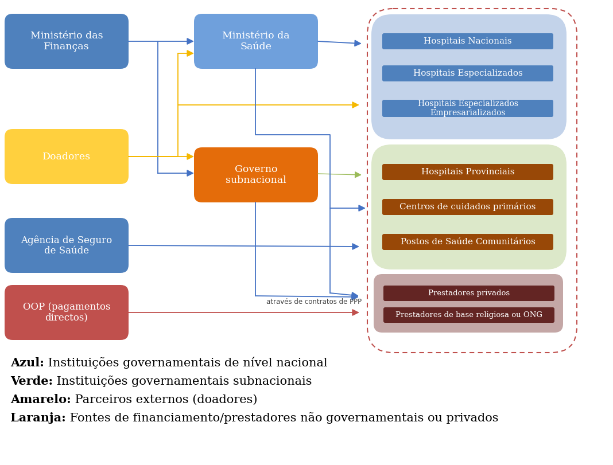

## Mapeamento dos Fluxos e Caracterização dos Ambientes de Regras

Esta tarefa capta a forma como os fundos circulam no sistema de saúde e as regras de GFP ao abrigo das quais são geridos, oferecendo uma imagem dinâmica do percurso dos recursos desde a libertação orçamental até à [prestação de serviços](../glossario.qmd#g-prestacao-de-servicos). O exercício de mapeamento aqui descrito deve ser orientado pelo(s) problema(s) de [prestação de serviços de saúde](../glossario.qmd#g-prestacao-de-servicos-de-saude) seleccionado(s) como foco do exercício FH. Compreender estes fluxos e ambientes de regras é essencial para identificar a forma como os sistemas de controlo afectam a utilização dos fundos. Por exemplo, nas Filipinas, um hospital provincial pode receber dotações orçamentais do Departamento de Saúde ou do governo local, reembolsos do regime de [seguro social de saúde](../glossario.qmd#g-seguro-social-de-saude) PhilHealth e subvenções ou apoio em espécie dos parceiros de desenvolvimento, cada um regido por regras de GFP diferentes. Por isso, esta etapa combina duas tarefas relacionadas:

- Mapear o [fluxo de fundos](../glossario.qmd#g-fluxo-de-fundos) relevante, para traçar a forma como os recursos passam pelos principais detentores de orçamento e intermediários até à linha da frente/aos beneficiários
- Caracterizar o ambiente de regras/política de GFP relevante, para compreender que sistemas de controlo (tesouraria, extraorçamental, doadores ou outro) se aplicam em cada fase.

## Mapeamento dos Fluxos de Financiamento

Esta etapa mapeia a forma como os fundos circulam pelas instituições até chegarem às unidades sanitárias ou a outros utilizadores finais7. Para construir uma imagem clara, as equipas devem identificar:

- Controladores de fundos: instituições que detêm ou controlam o conjunto inicial de fundos utilizado pelas várias componentes do sistema de saúde. Podem incluir o Ministério das Finanças (que aprova e liberta as dotações orçamentais), o Ministério da Saúde, os fundos de seguro de saúde (que gerem as contribuições), as entidades do governo local e os municípios, e os parceiros de desenvolvimento (quando fornecem fundos directamente às unidades sanitárias).
- Intermediários: instituições que recebem fundos públicos, directa ou indirectamente, de um detentor primário de fundos e os canalizam para os utilizadores finais ou para outros intermediários que, por sua vez, os canalizam para os utilizadores finais. Por exemplo, se um Departamento de Finanças subnacional receber fundos do Ministério das Finanças nacional para serviços de saúde e depois os transferir para centros de saúde subnacionais, está a actuar como intermediário. A mesma entidade pode ser simultaneamente utilizador final e intermediário para uma unidade de nível inferior/subsidiária.
- Utilizadores finais: instituições que utilizam os fundos para prestar serviços ou desempenhar um conjunto de outras funções. Por exemplo, as unidades sanitárias são muitas vezes utilizadores finais dos fundos. Os ministérios da saúde são utilizadores finais dos fundos na medida em que utilizam o dinheiro que lhes é atribuído para desempenhar funções ministeriais (por exemplo, formulação de políticas e regulação), em vez de o transferirem para outra instituição, como uma unidade sanitária.

O objectivo não é captar cada fluxo em pormenor, mas mapear as vias principais, mostrando como os recursos são detidos, transferidos, controlados e utilizados. Os mapas de fluxos devem ser organizados por categoria de utilizador final, para não sobrecarregar o diagrama. Mapas separados para os prestadores de serviços (hospitais, centros de saúde, unidades privadas e de ONG), para os serviços auxiliares e de apoio (agências de aquisição, laboratórios, farmácias) e para os cuidados preventivos ou comunitários permitem às equipas ver claramente que fontes de financiamento, intermediários, utilizadores finais e fluxos de financiamento se aplicam a cada grupo. Esta abordagem traz clareza e evidencia os arranjos de financiamento próprios de cada categoria. Este é o segundo produto-chave desta secção. Apresenta-se abaixo um exemplo, aplicável aos prestadores de serviços.

Figura A1.1: Exemplo de fluxo de fundos para os prestadores de serviços

{fig-align="center"}

Este diagrama oferece uma visão geral; contudo, as equipas nacionais podem acrescentar, em anexo, diagramas mais pormenorizados («ampliações»), por exemplo para os hospitais ou para os fluxos de seguros de saúde, quando necessário. Por exemplo, se os hospitais públicos nacionais (orçamentais) forem uma categoria importante de instituição de saúde no país em causa, será elaborado um diagrama separado que mostre o fluxo de fundos para esses hospitais. Isto permite às equipas identificar com precisão os pontos em que as regras moldam (ou perturbam) o fluxo de recursos.

É importante que estes diagramas de fluxo de fundos mostrem o percurso de todas as principais fontes de financiamento que estas instituições recebem. Por exemplo, para os hospitais públicos nacionais, cujo financiamento principal provém de dotações orçamentais, o diagrama mostraria também graficamente quaisquer fluxos de financiamento secundários, como o financiamento directo suplementar de doadores e os pagamentos directos dos doentes.

## Mapeamento do Ambiente de Regras de GFP

Depois de mapear quem controla e quem utiliza os fundos, esta etapa resume a forma como os fundos são regidos, libertados ao longo de cada via e executados/utilizados. O objectivo é identificar e caracterizar os principais mecanismos de libertação de fundos, e não documentar todas as regras. Por isso, para cada fonte principal de financiamento público do mapa de fluxos, as equipas descrevem em linhas gerais como são libertados os recursos, quem desencadeia a libertação e que controlos se aplicam.

Para cada via principal de financiamento, as equipas devem resumir a forma como os fundos são regidos e libertados, respondendo às seguintes perguntas:

- Como são alocados os fundos públicos e ao abrigo de que ambiente de regras (tesouraria, extraorçamental, doadores ou outro)?
- Quem controla os fundos e autoriza a sua libertação ([controlador de fundos](../glossario.qmd#g-controlador-de-fundos))?
- Como são os fundos transferidos ou desembolsados para as unidades executoras (a unidade executora é a entidade que executa o orçamento ou incorre em despesas)?
- Quem são os utilizadores finais (o utilizador final é a entidade que presta os serviços ou recebe os recursos)?
- Que regras ou mecanismos de supervisão regem estes fluxos?
- Em que podem ou não ser utilizados os fundos?
- Como são os fundos contabilizados/reportados?

As equipas podem consultar o menu de regras abaixo para conhecer as características típicas de cada ambiente.

::: {.callout-note title="Caixa A1.1: Exemplo ilustrativo de caracterização do ambiente de regras de GFP"}

Dotações do Tesouro (nível nacional)

Os fundos para os hospitais geridos a nível nacional são dotados ao Ministério da Saúde (detentor do orçamento) no orçamento nacional. As libertações são autorizadas pelo Ministério das Finanças ou pelo tesouro nacional (ponto de autorização) e executadas pelos hospitais enquanto unidades executoras. Estes fluxos são regidos pelas regras do tesouro nacional, incluindo a gestão centralizada da tesouraria, os procedimentos de [contratação pública](../glossario.qmd#g-contratacao-publica) e os requisitos de reporte financeiro.

Dotações do Tesouro (nível subnacional)

Os fundos para os hospitais subnacionais e as unidades de cuidados primários são dotados nos orçamentos provinciais, estaduais ou distritais (detentores do orçamento), tipicamente em estruturas orçamentais por rubricas ou definidas localmente. As libertações são geridas pelos tesouros ou departamentos de finanças subnacionais (pontos de autorização), sendo a despesa executada pelos serviços locais de saúde ou por cada unidade sanitária. Os utilizadores finais incluem os hospitais distritais, os centros de cuidados primários e os postos de saúde comunitários. Estes fluxos são regidos pelas regras dos tesouros subnacionais, com os processos de tesouraria e de contratação pública administrados localmente, mas alinhados com as normas nacionais de GFP.

Fundos de seguro de saúde

Os fundos são detidos pela agência nacional de seguro de saúde (gestor de fundos), sendo o desembolso autorizado através do seu sistema de facturação ou de reembolso (ponto de autorização). Os prestadores públicos e privados recebem os reembolsos enquanto unidades executoras e utilizam estes recursos para prestar serviços. Estes fluxos funcionam ao abrigo de regras extraorçamentais, segundo os estatutos da agência, os seus regulamentos financeiros internos e mecanismos de supervisão como as aprovações do conselho de administração e os procedimentos de [auditoria interna](../glossario.qmd#g-auditoria-interna).

:::

Tabela A1.1: [Ambiente de regras de GFP](../glossario.qmd#g-ambiente-de-regras-de-gfp)

| Ambiente | Subtipos | Características típicas do fluxo de fundos e do controlo |
|:--|:--|:--|
| Regras do Tesouro | Regras do tesouro nacional Regras dos tesouros subnacionais | Os fundos são dotados através do orçamento do Governo (estrutura por rubricas ou por programas) e libertados pelo Ministério das Finanças ou pelo tesouro local para o utilizador final, directamente ou através de intermediários como o MS. As unidades executoras executam a despesa ao abrigo das regras nacionais ou locais de GFP, incluindo os procedimentos de contratação pública e de auditoria. Os controlos de tesouraria e orçamentais são geridos centralmente, e a flexibilidade depende das disposições sobre transferências orçamentais ou realocações. |
| Regras extraorçamentais | Fundos criados por lei (por exemplo, seguro social de saúde, impostos consignados) Contas especiais ou fundos de contingência/emergência | Os fundos são cobrados ou consignados ao abrigo de legislação específica e geridos por uma agência ou conselho autónomo fora do sistema central do tesouro. Os desembolsos seguem regulamentos financeiros internos ou aprovações do conselho de administração, com mecanismos próprios de reporte e de auditoria. Estes fundos são muitas vezes utilizados para reembolsar ou financiar directamente os prestadores de serviços. |
| Regras dos doadores | Unidades de implementação de projectos (PIU) Fundos comuns ou verticais | Os fundos são desembolsados ao abrigo de acordos de financiamento com os doadores, tipicamente para uma PIU ou uma equipa de programa. A contratação pública, o reporte e a auditoria seguem procedimentos definidos pelos doadores. As libertações de fundos estão ligadas a marcos dos projectos ou a relatórios de despesa, e os fundos podem estar inscritos ou fora do orçamento, consoante os arranjos do país. |
| Fora da GFP / Regras não estatais | Taxas moderadoras e pagamentos directos Contratos geridos por ONG ou com prestadores privados | Os fundos são retidos e geridos directamente pelas unidades sanitárias ou pelos prestadores não estatais, segundo procedimentos internos ou contratuais. Estes fluxos não são regidos pelas regras financeiras públicas, e o reporte é feito tipicamente aos conselhos das unidades sanitárias, aos parceiros ou aos reguladores, e não ao sistema do tesouro. |

## Definições para o Mapeamento do Sistema de Saúde

Definição de Instituições de Saúde Governamentais Orçamentais vs. Extraorçamentais

Nem todas as instituições de saúde governamentais são instituições orçamentais. Esta distinção é importante para analisar como circulam os fundos e que regras de GFP se aplicam.

As instituições orçamentais são entidades governamentais cujas receitas e despesas são autorizadas pela lei do orçamento anual e executadas através do sistema do tesouro. Respondem directamente perante o Ministério das Finanças ou, nos sistemas descentralizados, perante o seu equivalente subnacional. Estas regras destinam-se a assegurar o controlo e a supervisão da despesa. Os ministérios centrais, os departamentos de saúde e os hospitais são muitas vezes classificados como instituições orçamentais.

As instituições extraorçamentais são entidades governamentais cujos orçamentos não estão integralmente cobertos pelo orçamento principal. Permanecem sob a supervisão do Ministério das Finanças, mas funcionam fora dos processos regulares do orçamento e do tesouro. Gerem muitas vezes os seus próprios recursos e funcionam ao abrigo de estatutos, conselhos de administração ou regras internas próprios, em vez dos procedimentos centrais do Ministério das Finanças (MF). Exemplos incluem os hospitais autónomos e, em alguns casos, os fundos de seguro social de saúde8. Isto pode aumentar a flexibilidade, mas também reduzir o alinhamento com os sistemas nacionais de GFP. Consequentemente, a forma como os fundos são libertados, utilizados e monitorados pode diferir significativamente da das instituições orçamentais.

Definições Institucionais

| Termo | Significado |
|:--|:--|
| Instituição de saúde governamental | Instituição de saúde que faz parte do sector do Governo geral, tal como definido no Manual de Estatísticas das Finanças Públicas (GFS) do FMI. O sector do Governo geral compreende todas as instituições públicas, excepto as sociedades públicas. As instituições do Governo geral são unidades governamentais — de que um ministério é exemplo — ou instituições sem fins lucrativos (NPI) governamentais não mercantis (GFS 2014: 2.58). Os hospitais e centros de saúde governamentais funcionam muitas vezes como NPI não mercantis, sobretudo nos países em desenvolvimento.4 |
| Instituição de saúde pública (empresa pública ou empresarializada) | Entidade de propriedade pública que funciona fora do sector do Governo geral, tipicamente como sociedade pública ou empresa pública que presta serviços de saúde numa base de mercado. Estas instituições são públicas quanto à propriedade, mas regem-se por regras societárias ou estatutárias, e não pela lei orçamental comum. |
| Instituição de saúde privada | Entidade de propriedade privada, com fins lucrativos ou como organização não governamental sem fins lucrativos (por exemplo, ONG ou prestador de base religiosa). Algumas instituições privadas prestam serviços financiados com recursos públicos através de contratos ou de mecanismos de reembolso. |
| Instituição orçamental | Instituição governamental cujo financiamento provém, na totalidade ou na maior parte, do orçamento do Governo. Segue tipicamente as regras comuns do MF (por exemplo, MS, serviços distritais de saúde, hospitais públicos). |
| Instituição extraorçamental (EBI) | Instituição governamental cujo financiamento público provém, na totalidade ou na maior parte, de fontes fora do orçamento6, como impostos ou taxas consignados. Tem tipicamente estatuto próprio (por exemplo, fundos de SHI, hospitais autónomos). |
| Unidade de saúde não governamental (privada ou de ONG) | Prestador não governamental financiado com fundos públicos para prestar serviços. Funciona tipicamente segundo termos contratuais, e não segundo a lei orçamental pública. |
| Entidade orçamental de primeiro nível | Recebe financiamento directamente do Ministério das Finanças através da dotação orçamental. |
| Entidade orçamental de segundo nível | Recebe fundos de um organismo público superior (por exemplo, direcção regional de saúde ou hospital distrital sob tutela do MS). |
| Nacional vs. subnacional | Identifica se uma instituição faz parte do Governo central ou de um governo local (provincial/distrital |

Definições das Fontes de Financiamento

O financiamento governamental é o que uma instituição de saúde recebe de uma instituição governamental, como o Ministério das Finanças, o Ministério da Saúde, uma autoridade regional de saúde governamental ou um fundo de seguro social de saúde. O financiamento governamental pode ser atribuído a unidades sanitárias governamentais ou não governamentais (por exemplo, pagamentos do Governo a um hospital privado para tratar doentes do sector público).

O financiamento orçamental é o financiamento governamental atribuído através de uma dotação no orçamento do Governo. O financiamento extraorçamental é o financiamento governamental atribuído através de um mecanismo que não o orçamento. Normalmente, trata-se de financiamento decorrente de legislação permanente, por exemplo, uma lei que determine que uma organização governamental de prevenção do cancro receba uma percentagem específica da receita de um imposto sobre os produtos do tabaco.

O financiamento dos serviços de saúde por seguro de saúde é um tipo específico de financiamento extraorçamental. Neste caso, o Governo cria por lei um fundo de seguro social de saúde, atribui-lhe receitas específicas (por exemplo, contribuições obrigatórias para o seguro de saúde) e incumbe o fundo de utilizar essas receitas para financiar serviços de saúde (por exemplo, reembolsando as unidades sanitárias pelos serviços prestados aos doentes).

O seguro de saúde voluntário refere-se a regimes privados ou comunitários financiados por contribuições ou prémios voluntários. Estão fora dos regimes governamentais obrigatórios ou do SHI, mas podem ser relevantes se interagirem com fundos públicos.

O financiamento não governamental é o financiamento atribuído às instituições de saúde governamentais por fontes não governamentais. As principais fontes de financiamento não governamental são as cobranças de pagamento directo ([OOP](../glossario.qmd#g-oop)) impostas aos doentes e o financiamento directo das unidades sanitárias governamentais por doadores.

O financiamento de doadores é classificado como financiamento governamental se for canalizado através dos orçamentos do Governo (por exemplo, como [apoio orçamental](../glossario.qmd#g-apoio-orcamental)), e como financiamento não governamental apenas quando é atribuído directamente às unidades sanitárias. Mais genericamente, o conceito de «financiamento governamental» nada tem a ver com a fonte de onde o próprio Governo recebe os fundos antes de os utilizar para financiar serviços de saúde. Refere-se apenas à fonte dos fundos na perspectiva da instituição de saúde que recebe o dinheiro.

O financiamento não governamental de instituições de saúde não governamentais – como as cobranças impostas pelos hospitais privados aos doentes privados – não faz parte da análise FinHealth, por estar fora do sistema de saúde financiado com recursos públicos.
