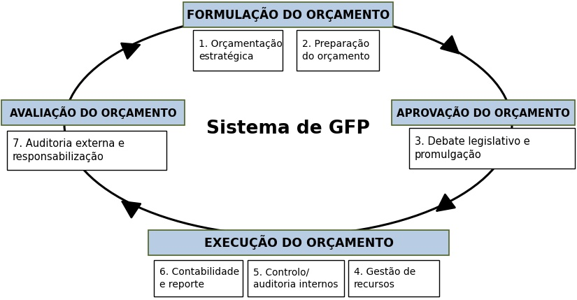

*Tradução integral para português do artigo [This is PFM](https://drive.google.com/file/d/1cHOXDeBl9pxa9CX_CCdcKevVmFYR4L44/view?usp=drive_link), de Matt Andrews, Marco Cangiano, Neil Cole, Paolo de Renzio, Philipp Krause e Renaud Seligmann (Harvard Kennedy School, 2014).*

Matt Andrews, Marco Cangiano, Neil Cole, Paolo de Renzio, Philipp Krause e Renaud Seligmann1

Julho de 2014

## Resumo

A sigla «PFM» significa Public Financial Management (em português, Gestão das Finanças Públicas, GFP). Mas o que é a gestão das finanças públicas? Esta breve nota procura desmistificar o conceito, com base nas perspectivas de especialistas da área que trabalham em contextos diferentes e trazem visões distintas (do meio académico, das agências de desenvolvimento multilaterais e bilaterais, dos centros de reflexão, do Governo e da sociedade civil). A nota não pretende ser prescritiva; oferece antes um ponto de entrada para uma discussão mais completa sobre os elementos constitutivos dos sistemas de GFP, sobre como e porque surgiram as reformas da GFP e sobre as lacunas que merecem atenção no futuro.

1 Harvard Kennedy School, Fundo Monetário Internacional, Collaborative African Budget Reform Initiative, International Budget Partnership, Overseas Development Institute e Banco Mundial, respectivamente. Este artigo não reflecte as opiniões nem as políticas de nenhuma destas organizações nem de qualquer outra entidade aqui mencionada.

## Introdução

GFP significa Gestão das Finanças Públicas e diz respeito à forma como os governos gerem os recursos públicos (tanto a receita como a despesa) e ao impacto imediato e de médio a longo prazo desses recursos na economia ou na sociedade. Enquanto tal, a GFP tem a ver tanto com o processo (como os governos gerem) como com os resultados (as implicações de curto, médio e longo prazo dos fluxos financeiros). Este texto introdutório descreve o nosso entendimento da GFP no que respeita a ambas as dimensões e oferece uma perspectiva sobre as reformas habitualmente introduzidas para melhorar os sistemas de GFP. Não pretende ser um tratado exaustivo, mas antes uma perspectiva ponderada, que suscite maior reflexão sobre o tema.

## Uma visão geral dos principais processos de GFP

Os sistemas de GFP estão inseridos em — e são influenciados por — conjuntos mais amplos de processos, sistemas e instituições. Pense-se, por exemplo, nas regras políticas que determinam como funcionam os orçamentos, ou na forma como os sistemas de gestão de recursos humanos se sobrepõem à gestão das finanças públicas. Os sistemas de GFP fazem também parte de processos nacionais de política mais amplos, que produzem directivas ou planos que informam a alocação dos recursos públicos. Estas influências variam de país para país, o que torna a GFP contextual. Apesar das diferenças de contexto, porém, alguns processos são semelhantes nos sistemas de GFP da maioria dos países. A Figura 1 ilustra-os.

**Figura 1. Uma visão simplificada de um sistema de GFP típico**

{fig-align="center"}

::: {.callout-note collapse="true" title="A figura original, em inglês"}

:::

Como a figura sugere, a maioria dos sistemas de GFP incorpora quatro fases, cada uma das quais pode ser subdividida em um ou mais processos-chave.

Muitos países iniciam a formulação orçamental com uma fase de «**orçamentação estratégica**», para assegurar que as directivas de política de alto nível informam as decisões orçamentais do Governo. Na sua forma mais básica, esta fase consiste em traduzir os grandes objectivos de política em metas financeiras, tendo em conta as condições previstas da economia e da sociedade. Os responsáveis pela previsão das receitas determinam quanto dinheiro se espera nos períodos seguintes, por exemplo, o que leva à fixação de um envelope de recursos (o montante que se prevê estar disponível para o Estado, que inclui a receita doméstica, a ajuda externa e o endividamento). Fazem-se cálculos semelhantes para a despesa proposta, gerando estimativas das necessidades de despesa nos diferentes sectores, organizações ou áreas de despesa (como funções ou programas). As estimativas de despesa são por vezes designadas por tectos e servem para indicar o montante máximo de financiamento disponível para cada unidade executora ou para objectivos específicos no orçamento seguinte.

A fase de orçamentação estratégica envolve várias entidades organizacionais (como os ministérios das finanças e do planeamento, os ministérios sectoriais, as entidades subnacionais que preparam estimativas de despesa e os grupos da sociedade civil que comentam o conteúdo das propostas de política, a qualidade das metodologias de previsão, etc.). Muitos países procuram produzir estimativas plurianuais através dos seus processos de orçamentação estratégica, e alguns utilizam mesmo este processo para gerar orçamentos por programas ou por desempenho (formas de classificar a despesa que mostram ligações explícitas entre os objectivos de política e a despesa).

Esta fase inicial, estratégica, da formulação orçamental é seguida pelo processo mais mecânico e iterativo de «preparação do orçamento», que envolve a preparação e a finalização da proposta formal de orçamento do Governo a submeter ao órgão legislativo. A proposta de orçamento abrange normalmente um ano. A sua preparação implica habitualmente a compilação de planos de despesa detalhados para cada área de actividade do Governo. O ministério das finanças desempenha um papel central neste processo. Por um lado, produz projecções detalhadas dos recursos disponíveis – os diferentes tipos de receitas, mais o endividamento interno e externo –, enquanto, por outro, trabalha com as unidades executoras na avaliação dos seus pedidos de despesa.

Normalmente, é emitida uma circular orçamental para enquadrar a interacção entre o ministério das finanças e as unidades executoras. A circular dá instruções para a apresentação dos pedidos de despesa e indica muitas vezes também os tectos (ou limites) de cada unidade executora (para assegurar que a dimensão global desses pedidos se mantém dentro do envelope global de recursos). O ministério das finanças e as unidades executoras negoceiam estes pedidos. O processo culmina numa proposta formal e abrangente de orçamento, que reflecte os planos de receita e de despesa de todo o Governo para o período orçamental seguinte. As rubricas da proposta de orçamento são normalmente classificadas de acordo com a natureza dos fluxos financeiros. Alguns países só apresentam estes fluxos por categorias económicas (se o dinheiro paga salários ou equipamento, por exemplo) ou por unidades administrativas (se o dinheiro vai para o ministério da agricultura ou para uma universidade). Outros países incluem informação sobre os fluxos destinados a funções e programas específicos (como a educação ou os cuidados de saúde primários) ou sobre o desempenho efectivo (como construir uma escola ou administrar 1000 vacinas numa determinada aldeia).

Esta proposta é depois submetida, para aprovação do orçamento, a um órgão político que representa os cidadãos. Trata-se normalmente do Parlamento ou do Congresso, onde decorrem o «debate legislativo e a promulgação». Este órgão examina muitas vezes em pormenor diferentes partes da proposta de orçamento, em comissões especializadas e frequentemente com o apoio de peritos técnicos e de organizações da sociedade civil. Os membros do executivo (e em especial o ministério das finanças) têm habitualmente de defender a proposta de orçamento perante estas comissões. Na maioria dos países, os representantes dispõem de algumas semanas para analisar a proposta, debatê-la e, por vezes, propor alterações. No final deste período (e normalmente antes do início do período a que respeita), a proposta de orçamento é formalmente adoptada e convertida em lei, autorizando o executivo a mobilizar e a gastar recursos de acordo com o seu conteúdo. A base sobre a qual o orçamento é aprovado — por rubrica específica, unidade administrativa, programa, etc. — é essencial para estabelecer as relações de responsabilização e de responsabilidade, bem como os requisitos e normas de reporte, como se discute mais adiante.

A execução orçamental segue-se à aprovação e à promulgação. A execução é simplesmente o conjunto de processos através dos quais os governos cumprem as promessas e as propostas incluídas no orçamento. Um conjunto de organizações e processos de «gestão de recursos», por exemplo, assegura que os recursos estão disponíveis para quem executa as políticas orçamentais, prestando serviços e, de forma mais geral, pondo o Governo a funcionar. Entre eles contam-se:

- São necessários processos para arrecadar os recursos financeiros exigidos pela execução do orçamento. Estes recursos são muitas vezes mobilizados pelas agências tributárias, aduaneiras e de gestão da dívida. Por vezes, os recursos financeiros são também mobilizados por outras entidades (como os ministérios sectoriais).
- Existe um processo para transferir os recursos financeiros de quem os arrecada para quem precisa de liquidez para pagar as contas. Os tesouros desempenham habitualmente este papel, assegurando a circulação estruturada do dinheiro em todo o Governo. Muitos governos utilizam para este fim contas únicas do tesouro, que constituem um repositório único no qual é detida toda a liquidez e a partir do qual toda ela é alocada e os pagamentos são processados.
- Os governos utilizam tipicamente a maior parte dos seus recursos financeiros para pagar os custos com o pessoal da função pública. Os processos de gestão de recursos humanos orientados para o pagamento de salários e vencimentos, benefícios e pensões dos funcionários públicos são, por isso, uma parte essencial do sistema de GFP. Estes processos são habitualmente definidos e supervisionados por organismos centrais (como os serviços da função pública), mas executados pelas unidades executoras. Em muitos países, os tesouros centrais asseguram o pagamento dos salários e vencimentos.
- Uma parte adicional da despesa orçamentada destina-se à compra de bens e serviços. Por isso, os sistemas de GFP incluem normalmente processos que permitem a aquisição desses bens e serviços pelos organismos do Estado no mercado aberto. Estes processos estruturam a forma como os organismos lançam concursos para as suas compras, escolhem os fornecedores, acompanham a entrega e, por fim, pagam os bens e serviços. Os principais organismos envolvidos neste processo incluem os serviços centrais de contratação pública (que muitas vezes definem as regras e os procedimentos de contratação e monitoram o processo global) e os responsáveis pela contratação nas unidades executoras (que aplicam as regras e realizam efectivamente as aquisições).
- Por fim, a despesa de investimento é uma componente integrante da gestão de recursos. Muitos governos tratam-na separadamente da restante despesa, isolando a despesa de investimento da despesa recorrente. Existem, por isso, muitas vezes processos específicos para avaliar e custear os projectos de investimento, lidar com os empreiteiros e gerir os fluxos de dinheiro necessários para construir novas infra-estruturas e realizar actividades de manutenção de grande escala.

A maioria dos governos dispõe de processos para assegurar que os sistemas de gestão de recursos funcionam sem sobressaltos e que todas as operações relacionadas com o orçamento cumprem as regras estabelecidas. Os processos de «**controlo interno e auditoria****» são importantes a este respeito. Os controlos internos são processos concebidos para assegurar o cumprimento das regras e procedimentos estabelecidos, ao passo que as auditorias internas fornecem aos organismos informação sobre as áreas de risco em que os controlos são insuficientes ou em que o incumprimento rotineiro das regras pode comprometer a capacidade de uma organização de atingir os seus objectivos. Estes processos estão sob a responsabilidade de organismos de monitoria, de entidades de inspecção ou de órgãos de auditoria interna. Em alguns países, esta função está centralizada para todo o Governo; noutros, está delegada em cada unidade executora.**

Os governos dispõem habitualmente também de processos de «**contabilidade e reporte**». Estes permitem ao Governo manter registos dos fluxos financeiros e estruturar esses registos de forma a permitir um escrutínio independente. O tesouro nacional participa muitas vezes na definição do funcionamento destes mecanismos, mas todas as unidades executoras terão responsáveis contabilísticos encarregados de os pôr efectivamente a funcionar (mantendo as contas e produzindo relatórios). As abordagens contabilísticas diferem entre governos. Umas vezes, estas abordagens registam apenas os fluxos de caixa; outras vezes, registam também os compromissos não monetários (quando os governos assumem obrigações antes de gastarem efectivamente o dinheiro).

Os regimes de classificação utilizados para registar e reportar os fluxos financeiros podem também diferir. A maioria dos governos procura assegurar que o esquema de classificação utilizado na contabilidade e no reporte corresponde ao utilizado no orçamento promulgado, como acima referido. Isto permite aos governos produzir relatórios que mostram se a receita e a despesa efectivas estão alinhadas com a lei orçamental original. Os relatórios financeiros são muitas vezes produzidos tanto durante o ano (para mostrar o progresso da execução orçamental enquanto a despesa decorre) como depois do fim do período orçamental (para fornecer um registo completo das actividades financeiras do Governo e da sua comparação com o que foi inicialmente planeado).

Os governos são habitualmente obrigados a enviar os seus relatórios financeiros anuais a órgãos independentes, para os processos de «auditoria externa e responsabilização» que encerram cada ciclo orçamental. Em alguns países, estas entidades são órgãos de auditoria especializados que respondem perante a mesma instituição que converteu o orçamento em lei — tipicamente o parlamento ou o congresso —, enquanto noutros fazem parte do poder judicial. O principal papel destas Instituições Superiores de Controlo (SAI) é examinar se as actividades financeiras do Governo foram realizadas em conformidade com a lei orçamental original e com respeito por todas as outras regras e procedimentos. Por outras palavras, são as guardiãs da integridade do sistema de gestão das finanças públicas. Além disso, as SAI auditam por vezes a relação custo-benefício da despesa pública (examinando, por exemplo, que tipos de serviços foram comprados com dinheiro público).

Os seus relatórios e constatações são utilizados pelos órgãos legislativos para levantar questões e preocupações junto do executivo no seu conjunto (a partir das auditorias às demonstrações financeiras anuais, por exemplo) e junto de cada organismo do executivo individualmente (a partir das auditorias de relação custo-benefício, por exemplo).

Os funcionários do Governo têm muitas vezes de comparecer perante comissões especializadas para responder a preocupações sobre a despesa, e normalmente têm de responder detalhando as acções correctivas que tencionam tomar. Os relatórios podem também ser utilizados por entidades da sociedade civil que procuram responsabilizar os governos pela forma como utilizam os recursos. Os tribunais de contas podem, por vezes, investigar e sancionar directamente casos específicos de má gestão e de incumprimento.

Os processos acima descritos representam características comuns dos sistemas de GFP num vasto leque de países, apesar das diferenças e particularidades evidentes que cada sistema inevitavelmente apresentará. Apresentámos os pontos comuns de forma bastante simplificada, sugerindo que os processos se sucedem de forma linear e com responsabilidades claras. Na realidade, porém, a situação é mais complexa, devido a duas questões adicionais.

- Em primeiro lugar, decorrem habitualmente vários ciclos orçamentais em simultâneo. O processo de auditoria externa e responsabilização relativo à despesa do ano anterior decorre enquanto os processos de gestão de recursos estão activos para o ano corrente. Ao mesmo tempo, o processo de orçamentação estratégica já começou para o ano seguinte. Por isso, a gestão das finanças públicas consiste em processos sobrepostos num sistema complexo.
- Em segundo lugar, cada processo envolve um vasto leque de órgãos, entidades e organismos do Estado, todos com características, prioridades e interesses próprios. As unidades executoras querem ver aumentar a sua dotação orçamental, por exemplo, mas os ministérios das finanças têm a missão de manter a despesa global sob controlo. Estas tensões fazem do processo de GFP um processo competitivo e controverso. Em muitos países, as organizações internacionais contribuem para esta mistura, aconselhando os governos em iniciativas de reforma e financiando, por vezes, uma parte substancial da despesa pública.

## Objectivos e funções da GFP

A discussão feita até aqui deu uma ideia de como são, em geral, os sistemas de GFP — na perspectiva dos processos — e de quão complexos são. A variedade de arranjos institucionais encontrados nos diferentes países pode complicar ainda mais esta discussão. Por exemplo, a maioria dos países do mundo tem hoje alguma forma de instituição de auditoria externa que verifica as contas do Governo. Mas existem modelos diferentes, mesmo entre as democracias ocidentais: as dirigidas por um auditor-geral que responde perante o órgão legislativo (como na África do Sul), os tribunais de contas com poderes quase jurisdicionais (como em França) ou os colégios de auditores (como na Alemanha). Algum destes é mais funcional do que os outros? Aliás, ter um auditor externo independente é sequer um requisito para assegurar que os fundos públicos não são desperdiçados, perdidos ou roubados? Poderia o mesmo objectivo ser alcançado por outros meios? Estas preocupações conduzem a uma pergunta importante, e muitas vezes não formulada, sobre os sistemas de GFP: «Quais são os principais objectivos e funções de um sistema de GFP?» Dito de outra forma: «Porque é que os países têm, afinal, estes processos?»

Ao reflectir sobre esta pergunta, pensámos nas funcionalidades básicas que se espera ver emergir de um sistema de GFP. Uma dessas funcionalidades diz respeito à forma como os sistemas de GFP influenciam a tomada de decisão e a solvência no sector público. A maioria dos observadores esperaria que um sistema de GFP promovesse uma tomada de decisão prudente e a saúde fiscal sustentada do Governo (de modo que os défices não sejam demasiado elevados, a dívida seja gerível e a despesa seja priorizada de forma a ser gerível). A maioria esperaria também que os sistemas de GFP proporcionassem os meios ordenados pelos quais os governos mobilizam e gastam dinheiro, promovendo a credibilidade e a fiabilidade. Um resultado crítico de um orçamento credível e fiável é que o dinheiro chegue à interface da linha da frente entre o Governo e os cidadãos — onde os recursos financeiros conduzem a resultados reais e à prestação de serviços. Sem um nível básico de funcionalidade, os governos não controlam efectivamente o fluxo de fundos, uma análise significativa da despesa é impossível e as discussões sobre as escolhas de política não podem ter lugar. Os responsáveis públicos que não podem contar com o sistema de GFP para produzir resultados têm de recorrer a outros meios, informais e não oficiais, para obter o que pretendem, abrindo as portas à ineficiência, ao desperdício e à corrupção.

Espera-se também que o sistema de GFP forneça elementos aos sistemas de responsabilização e de contestação de um Governo. Isto não significa necessariamente transparência e responsabilização no sentido democrático ocidental. Mas toda a burocracia com a dimensão e a complexidade modernas assenta em algum sistema de registo das operações do Governo, de que as operações financeiras são parte fundamental. Qualquer sistema de GFP tem de registar e fazer chegar esses registos aos lugares certos de forma fiável e atempada, para que possam ser auditados, porque, sem uma auditoria adequada, os políticos e os cidadãos não têm qualquer garantia de que o dinheiro está a ser utilizado correctamente.

Com base neste raciocínio, fixámo-nos em quatro dimensões principais, fundamentais para um sistema de GFP funcional. Estas sugerem que os sistemas de GFP funcionais promovem (i) decisões fiscais prudentes, (ii) orçamentos credíveis, (iii) fluxos de recursos e transacções fiáveis e eficientes e (iv) uma responsabilização institucionalizada. Resumimo-las a seguir.

### Decisões fiscais prudentes

- As decisões de despesa são comportáveis (o défice, os níveis de dívida e os pagamentos da dívida são geridos),
- A dívida pública é levada a sério (o Governo sabe o que deve, os credores são pagos a tempo, os pagamentos da dívida são tratados como encargo prioritário (directo)),
- Os défices, a dívida, a tesouraria e as obrigações situam-se em níveis que não ameaçam a solvência nem a estabilidade económica num futuro previsível.

### Orçamentos credíveis

- São formulados orçamentos abrangentes e regulares, que dão expressão vinculativa às prioridades e aos planos de finanças públicas do Governo,
- As políticas de receita e o desempenho efectivo da arrecadação reflectem as propostas e as previsões,
- A despesa efectiva reflecte as promessas orçamentadas (em termos agregados e nas dotações detalhadas),

### Fluxos de recursos e transacções fiáveis e eficientes

- Os fundos são disponibilizados às unidades executoras quando acordado e nos montantes acordados,
- Os salários são pagos atempadamente; os atrasados são baixos ou inexistentes,
- Os bens e serviços são adquiridos quando planeado, com qualidade e preço adequados,
- Os contratos são pagos a tempo; as penalizações são baixas ou inexistentes,
- O financiamento está disponível para os projectos de investimento quando acordado e nos montantes acordados,
- A corrupção e as perdas por incumprimento (em salários, contratos, etc.) são mínimas.

### Responsabilização institucionalizada

- É possível acompanhar os fluxos de fundos até às unidades de prestação de serviços,
- Os relatórios financeiros são abrangentes e atempados, permitem comparar a despesa efectiva com as decisões orçamentais e são acessíveis aos representantes políticos e aos cidadãos,
- Existe uma garantia independente (por exemplo, através de auditoria) de que os fundos são arrecadados, geridos e gastos para as finalidades previstas, em conformidade com as leis e os regulamentos e tendo em conta a relação custo-benefício,
- As preocupações levantadas pelos exercícios de garantia independente são discutidas de forma transparente pelos representantes dos cidadãos e recebem seguimento e correcção atempados por parte do executivo.

A nossa forma de pensar os objectivos e as funções difere ligeiramente do pensamento convencional, segundo o qual a funcionalidade dos sistemas de GFP deveria ser avaliada em função da estabilidade macroeconómica e da eficiência alocativa e operacional. Consideramos que as quatro dimensões de funcionalidade da GFP aqui discutidas influenciam estes três factores, mas defendemos também que a estabilidade macroeconómica e a eficiência alocativa e operacional são influenciadas por outros factores (e não são, por isso, medidas directas da funcionalidade da GFP). A disciplina fiscal, por exemplo, é influenciada pela prudência e pela credibilidade dos padrões de receita e de despesa, mas também pelas oscilações do ciclo económico, por alterações dos mecanismos de decisão política, pelas rendas dos recursos naturais ou da ajuda, etc. Defendemos que uma medida directa da funcionalidade da GFP deve reflectir os impactos directos do sistema de GFP (perguntando se promove decisões fiscais prudentes, orçamentos credíveis, fluxos de recursos e transacções fiáveis e eficientes e uma responsabilização institucionalizada), mais do que se o país tem estabilidade macroeconómica ou eficiência alocativa (que só em parte são influenciadas pelos sistemas de GFP).

## Reformas da GFP

Os objectivos e as funções acima descritos revelaram-se difíceis de alcançar em muitos países, o que significa que muitos sistemas de GFP não são tão funcionais como seria desejável. Por isso, são habitualmente introduzidas reformas da GFP para ajudar a melhorar a funcionalidade. Essas reformas podem ser definidas como «mudanças deliberadas nas instituições orçamentais com vista a melhorar a sua qualidade e os seus resultados». Os países introduzem muitas vezes estas reformas com a ajuda de organizações internacionais. Nas duas últimas décadas, o apoio externo total às reformas da GFP multiplicou-se por dez, de cerca de 50 milhões de dólares americanos em 1995 para cerca de meio milhar de milhões de dólares americanos no final da década de 2000. As reformas ocorrem numa grande variedade de países, mas tendem a recorrer a um conjunto comum de intervenções. Algumas reformas generalizadas incluem:

- *Quadros de Despesa de Médio Prazo (MTEF):* Os MTEF são exercícios plurianuais de orçamentação estratégica, muitas vezes vistos como uma forma de conciliar a disciplina fiscal agregada com os planos de despesa pública. A sua forma exacta varia muito. São introduzidos com o objectivo de criar melhores ligações entre as políticas e os planos que os ministérios produzem e as previsões de receita e de despesa que os ministérios das finanças produzem. O objectivo é orientar os processos anuais de alocação de recursos.
- *Regras fiscais:* Muitos governos introduziram regras para limitar a despesa (ou a dívida e os défices). Estas podem assumir a forma de leis de equilíbrio orçamental, de limites de endividamento e de tectos administrativos utilizados para conter e restringir as propostas orçamentais.
- *Processos formalizados de preparação do orçamento:* Várias reformas procuram dar estrutura e formalidade aos processos de preparação do orçamento. Estas incluem a introdução de calendários orçamentais (para que fique claro quando decorrem as diferentes etapas da preparação do orçamento) e a utilização de circulares para clarificar o que deve acontecer em cada etapa.
- *Sistemas de classificação orçamental:* A codificação e a classificação das rubricas orçamentais segundo a sua natureza económica, administrativa ou funcional permitem interpretar e analisar o que, de outro modo, seria uma grande quantidade de números não especificados nos relatórios orçamentais. Quanto mais detalhado for o sistema de classificação orçamental utilizado, mais completa e útil será a imagem que dará das operações do Governo. As organizações internacionais desenvolveram normas comuns de classificação orçamental (como as Estatísticas das Finanças Públicas do FMI ou o sistema COFOG das Nações Unidas).
- *Orçamentação por programas ou por desempenho:* Esta reforma assenta na ideia de que uma execução eficaz das políticas exige que a gestão orçamental deixe de se limitar ao controlo dos insumos e à garantia da conformidade financeira e passe a dar ênfase aos produtos e resultados associados aos objectivos de política pública. Envolve habitualmente uma alteração do sistema de classificação orçamental (classificando a despesa segundo objectivos estratégicos ou mesmo segundo os resultados previstos) e alterações nos processos de alocação de recursos, de contabilização dos fluxos de recursos (para assegurar ligações entre as alocações efectivas de recursos e os objectivos de desempenho) e de aprovação das dotações pelos órgãos legislativos.
- *Reforço do poder legislativo:* Muitos países empreenderam reformas destinadas a melhorar o papel que os órgãos legislativos (como os parlamentos) desempenham no processo de GFP. Estas reformas incluem muitas vezes esforços explícitos para dar a estes órgãos tempo suficiente para apreciar os orçamentos (através de reformas do calendário orçamental) e para reforçar as capacidades de assessoria de que os órgãos legislativos dispõem (muitas vezes através da criação de gabinetes orçamentais nos parlamentos). Estes gabinetes ajudam a apreciar as propostas de orçamento, a estruturar as audições sobre os orçamentos e a avaliar os relatórios de despesa e as auditorias.
- *Agências independentes de arrecadação de receitas:* As reformas da receita das últimas décadas centram-se habitualmente na melhoria da eficiência e da transparência da formulação da política de receitas e da arrecadação. As reformas procuram criar serviços independentes de receita e de alfândegas e racionalizar e simplificar as políticas e os processos tributários e aduaneiros.
- *Contas Únicas do Tesouro (TSA):* Nas duas últimas décadas, a maioria dos países empreendeu reformas destinadas a introduzir TSA. Estas centralizam a maior parte dos saldos e fluxos financeiros dos governos, assegurando que a receita fica depositada num único lugar e que os pagamentos são também consolidados.
- *Sistemas Integrados de Informação de Gestão Financeira (IFMIS):* Com a expansão das infra-estruturas de tecnologias de informação no mundo em desenvolvimento, a automatização e a «informatização» da gestão orçamental passaram a ser vistas como um passo necessário na modernização da gestão das finanças públicas. As instituições internacionais que apoiam as reformas orçamentais fizeram da introdução de Sistemas Integrados de Informação de Gestão Financeira (IFMIS) uma componente normal dos «pacotes» de reforma orçamental nos países em desenvolvimento. O objectivo é corrigir as fragilidades de sistemas contabilísticos manuais desactualizados e promover: (a) um acesso rápido e eficiente aos dados financeiros; (b) controlos financeiros reforçados em cada fase da execução orçamental; e (c) maior eficiência e eficácia da gestão financeira do Governo.
- *Contratação pública:* *Muitos países empreenderam reformas da contratação pública que criam serviços independentes encarregados de definir e supervisionar as regras que regem a contratação pública. Estas regras promovem tipicamente processos de concurso transparentes e uma contratação competitiva (em que são apresentadas várias propostas e um processo assegura a concorrência entre elas). Visam também aumentar a eficiência (muitas vezes designada por relação custo-benefício) e a eficácia (centrada na atempação das entregas).*
- *Gestão de recursos humanos independente e transparente:* Foram muitas vezes criadas agências independentes para definir as regras de contratação, despedimento, remuneração e outros processos de gestão de recursos humanos. O objectivo é promover um recrutamento competitivo e sistemas de função pública baseados no mérito. Estes serviços procuraram também, habitualmente, criar sistemas para registar e acompanhar o número de pessoas que trabalham no Estado (por vezes designados por cadastros de recursos humanos e por vezes integrados em Sistemas de Informação de Gestão de Recursos Humanos (HRMIS)). É comum procurar ligar os cadastros de pessoal às folhas salariais e assegurar a integridade de ambos, como forma de garantir que os salários são pagos a tempo e que a corrupção na função pública é minimizada. Alguns países chamam a isto reforma da folha salarial.
- *Controlo interno, auditoria interna e monitoria:* Muitos países introduziram ou reforçaram os controlos internos nas últimas décadas, com a intenção de aumentar a formalidade do processo de GFP e o cumprimento dos requisitos processuais formais. Os governos introduzem também tipicamente leis, unidades e processos de auditoria interna, para assegurar que o cumprimento é avaliado por rotina e que os gestores do sistema de GFP recebem retorno constante sobre os riscos. Os mecanismos de monitoria são também comuns em muitos governos, centrados no desempenho e/ou na conformidade.
- *Reformas da contabilidade e do reporte:* Muitos governos procuraram reforçar as actividades de contabilidade e de reporte. As reformas envolvem a normalização dos planos de contas e a profissionalização da função contabilística em todo o Governo. Os procedimentos contabilísticos foram formalizados em muitos lugares, e as entidades do Estado estão sujeitas a requisitos comuns para (entre outras coisas) pedir fundos, reportar a sua utilização e classificar os saldos e fluxos de fundos. Estas reformas estão muitas vezes ligadas aos esforços de modernização dos esquemas de classificação e de introdução de sistemas IFMIS.
- *Reformas da auditoria externa e da responsabilização externa:* É comum encontrar países que criam ou reforçam o papel de entidades independentes encarregadas de realizar exercícios de garantia (na maioria dos casos, o órgão de auditoria externa). Estes esforços estão muitas vezes associados a tentativas de reforçar o papel dos órgãos legislativos..
- *Transparência orçamental e da despesa e participação dos cidadãos:* As reformas de transparência e responsabilização tornaram-se mais recentemente o foco de maior atenção e actividade no domínio da reforma da GFP. São muitas vezes lideradas por actores como grupos da sociedade civil, parlamentos e instituições de auditoria que defendem que os orçamentos devem estar mais abertos ao escrutínio independente, para que possam ser estabelecidos pesos e contrapesos adequados que assegurem que os executivos utilizam os recursos públicos de forma responsável e eficaz.

## O que sabemos sobre os sistemas dos países?

O interesse crescente pelas reformas da GFP tem sido acompanhado por esforços para quantificar a qualidade dos sistemas de GFP dos países. O quadro da Despesa Pública e Responsabilização Financeira (PEFA) é provavelmente o mecanismo de avaliação mais conhecido. Foi desenvolvido por um consórcio de doadores e é composto por 31 indicadores que abrangem todas as fases do ciclo orçamental, a abrangência e a transparência do orçamento e a credibilidade orçamental. Existem também outros instrumentos, incluindo a Budget Practices and Procedures Database da OCDE, o Open Budget Index (OBI) e o Código de Transparência Fiscal do FMI, recentemente revisto.

Estes mecanismos de avaliação tendem a avaliar o grau em que os processos de GFP obedecem a formas consideradas «boas práticas» e prestam menos atenção às funcionalidades que se presume que essas boas práticas produzem. Por exemplo, muitas medidas da qualidade dos sistemas de classificação orçamental examinam o cumprimento das normas internacionais existentes, e não a utilidade dos sistemas de classificação para a formulação de políticas nacionais. Centram-se no número de anos abrangidos pelas estimativas prospectivas de um orçamento e na existência de estratégias sectoriais custeadas, em vez de examinarem as características das decisões estratégicas de alocação de recursos que os governos tomam. Medem a transparência orçamental contando o número de documentos que os governos publicam, em vez de examinarem a utilidade dessa informação orçamental para as partes interessadas nacionais.

A tabela seguinte mostra (de forma muito simplificada) como os quadros existentes dão demasiada ênfase à forma e pouca ênfase à funcionalidade. Deve ser particularmente marcante notar que os quadros existentes não oferecem qualquer conhecimento real sobre a funcionalidade dos fluxos de recursos e das transacções: não há avaliações da fiabilidade dos fluxos de tesouraria, das transacções de contratação pública ou do pagamento de salários e vencimentos. Em todas estas áreas, as avaliações comuns centram-se apenas em saber se os países dispõem de processos formais que obedeçam às «boas práticas internacionais» (como ter mecanismos de contratação pública competitivos).

Tabela 1. Temos uma visão limitada da funcionalidade dos sistemas de GFP

| Aspecto funcional | Os quadros de avaliação existentes reflectem a funcionalidade? | Os quadros existentes reflectem a conformidade dos processos (presumivelmente) associada à funcionalidade? |
|:--|:--|:--|
| Decisões fiscais prudentes | Em parte | Sim |
| As decisões de despesa são comportáveis (o défice, os níveis de dívida e os pagamentos da dívida são geridos) | Em parte | Sim |
| A dívida pública é levada a sério (o Governo sabe o que deve, os credores são pagos a tempo, os pagamentos da dívida são tratados como encargo prioritário (directo)) | Em parte | Sim |
| Os níveis de défice, dívida e obrigações não ameaçam a solvência/estabilidade económica num futuro previsível | Sim | Sim |
| Orçamentos credíveis | Sim | Sim |
| São formulados orçamentos abrangentes e regulares, que dão expressão vinculativa às prioridades e aos planos de finanças públicas do Governo | Sim | Sim |
| As políticas de receita e o desempenho efectivo da arrecadação reflectem as propostas e as previsões | Sim | Sim |
| A despesa efectiva reflecte as promessas orçamentadas (em termos agregados e nas dotações detalhadas) | Sim | Sim |
| Fluxos de recursos e transacções fiáveis e eficientes | Não | Sim |
| Os fundos são disponibilizados às unidades executoras quando acordado e nos montantes acordados | Não | Sim |
| Salários pagos a tempo; atrasados baixos/inexistentes | Não | Sim |
| Os bens e serviços são adquiridos quando planeado, com qualidade e preço adequados | Não | Sim |
| Contratos pagos a tempo; penalizações baixas/inexistentes | Não | Sim |
| O financiamento está disponível para os projectos de investimento quando acordado e nos montantes acordados | Não | Não |
| A corrupção e as perdas por incumprimento (em salários, contratos, etc.) são mínimas | Não | Sim |
| Responsabilização institucionalizada | Em parte | Sim |
| É possível acompanhar os fluxos de fundos até às unidades de prestação de serviços | Não | Sim |
| Os relatórios financeiros são abrangentes, atempados, permitem comparar a despesa efectiva com a planeada e são acessíveis aos representantes e aos cidadãos | Em parte | Sim |
| Existe garantia independente (por exemplo, através de auditoria) de que os fundos são arrecadados, geridos e gastos legalmente e tendo em conta a relação custo-benefício | Sim | Sim |
| As preocupações levantadas pelos exercícios de garantia independente são discutidas de forma transparente pelos representantes dos cidadãos e recebem seguimento e correcção atempados por parte do executivo | Não | Sim |

Esta visão funcional limitada pode não ser um problema, se soubermos com segurança que obedecer às formas de «boas práticas» produz efectivamente funcionalidade. Se houvesse evidência à prova de bala de que uma contratação pública competitiva gera um fornecimento fiável e eficiente de bens e serviços, por exemplo, poderíamos, com segurança, medir apenas o cumprimento dos procedimentos de contratação competitiva. Infelizmente, não temos essa evidência, e deve dizer-se que muitos países da OCDE alcançam níveis de funcionalidade relativamente elevados sem necessariamente cumprirem estes processos. Estes países moldam os seus sistemas às suas realidades e têm muitas vezes mecanismos e processos que parecem bastante semelhantes, mas que diferem em aspectos importantes. Muitos países em desenvolvimento não têm esta flexibilidade, porém, e são forçados a cumprir os requisitos processuais do PEFA e de outras avaliações devido à pressão dos doadores (mesmo que esse cumprimento não produza uma melhor GFP, porque as reformas não se «ajustam» aos contextos locais). A relação de dependência torna simultaneamente difícil e importante assegurar que fica espaço para a escolha local do tipo de reformas, para a adaptação e para a aprendizagem. O objectivo deve ser ajudar a ajustar uma «boa prática» a um contexto local, para que as instituições de GFP possam responder mais directamente a questões e problemas definidos localmente e corresponder à capacidade e às realidades políticas locais.

## O que poderia ser a GFP?

Este breve texto introdutório mostra que um grupo de especialistas de várias organizações e áreas pode chegar a acordo — pelo menos em certa medida — sobre os elementos básicos da GFP: o que é, como é a funcionalidade, o que as reformas têm envolvido e onde estão as lacunas nos actuais pacotes de reforma. A síntese desta discussão é que sabemos muito sobre o que é a GFP, sobre como poderiam ser sistemas de GFP funcionais e até sobre os tipos de reformas (gerais) necessários para alcançar maior funcionalidade. Há, no entanto, um grande desafio para a GFP no futuro — sobretudo, mas não exclusivamente, nos países em desenvolvimento —, que se centra em avaliar melhor a funcionalidade dos sistemas de GFP e em descobrir como moldar as reformas em torno do desafio de melhorar o desempenho funcional. A GFP pode ter estado enviesada para a forma no passado, mas poderá centrar-se mais na função no futuro.
