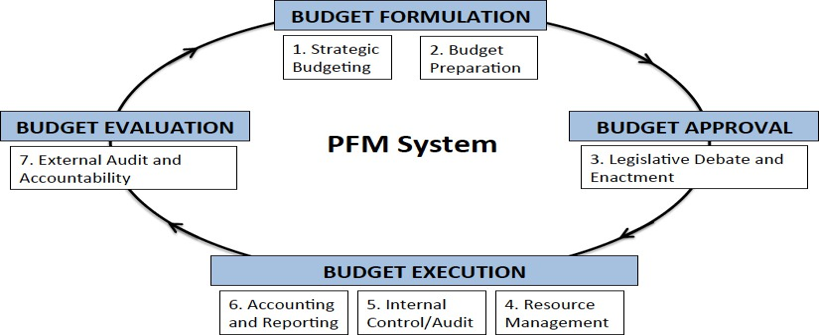

*Tradução integral do documento [This is PFM](https://drive.google.com/file/d/1cHOXDeBl9pxa9CX_CCdcKevVmFYR4L44/view?usp=drive_link) para o português (com a terminologia e ortografia técnica adequadas ao contexto de finanças públicas em Angola, como *Gestão das Finanças Públicas – GFP*, *exercício económico*, *Assembleia Nacional*, *Tribunal de Contas*, *SIGFE/TSA*, entre outros termos padrão da administração pública angolana):*

**Matt Andrews, Marco Cangiano, Neil Cole, Paolo de Renzio, Philipp Krause e Renaud Seligmann¹**

**Julho de 2014**


## Resumo

A sigla "GFP" refere-se à Gestão das Finanças Públicas (*Public Financial Management*): mas o que é, afinal, a gestão das finanças públicas? Esta breve nota procura desmistificar o conceito, baseando-se nas perspectivas de especialistas da área que actuam em contextos diversos e trazem visões distintas (do meio académico, de agências de desenvolvimento multilaterais e bilaterais, centros de estudos e reflexão (*think tanks*), governo e sociedade civil). O documento não pretende ser prescritivo, mas oferecer um ponto de partida para uma discussão mais abrangente sobre os elementos constitutivos dos sistemas de GFP, como e por que surgiram as reformas de GFP e onde se encontram as lacunas que exigem atenção futura.

¹ *Harvard Kennedy School*, Fundo Monetário Internacional, *Collaborative Africa Budget Reform Initiative* (CABRI), *International Budget Partnership*, *Overseas Development Institute* e Banco Mundial, respectivamente. Este artigo não reflecte as opiniões ou políticas de nenhuma destas organizações nem de qualquer outra entidade aqui mencionada.


## Introdução

A GFP diz respeito à forma como os governos gerem os recursos públicos (tanto as receitas como as despesas) e ao impacto imediato, a médio e a longo prazos desses recursos na economia ou na sociedade. Como tal, a GFP abrange tanto os **processos** (como os governos gerem) quanto os **resultados** (as implicações de curto, médio e longo prazos dos fluxos financeiros). Este guia introdutório descreve a nossa visão sobre a GFP ao incidir sobre ambas as dimensões e oferece uma perspectiva sobre as reformas normalmente introduzidas para melhorar os sistemas de GFP. Não pretende ser um tratado exaustivo, mas uma reflexão orientada a suscitar debates mais aprofundados sobre o tema.


## Visão geral dos principais processos de GFP

Os sistemas de GFP estão inseridos em — e são influenciados por — conjuntos mais amplos de processos, sistemas e instituições. Pense-se, por exemplo, nas regras políticas que determinam o funcionamento dos orçamentos, ou no modo como os sistemas de gestão de recursos humanos se sobrepõem à gestão das finanças públicas. Os sistemas de GFP também integram processos nacionais de políticas públicas mais amplos, responsáveis por produzir directrizes ou planos que orientam a afectação de recursos públicos. Essas influências variam entre países, tornando a GFP contextual. Não obstante as diferenças contextuais, alguns processos são comuns aos sistemas de GFP na maioria dos países. A Figura 1 ilustra estes fluxos.


### Figura 1. Visão simplificada de um sistema típico de GFP

```{=html}
<svg class="gfp-fig" viewBox="0 0 960 406" role="img" aria-label="Ciclo do sistema de gestão das finanças públicas, com quatro etapas e sete processos">
<defs><marker id="gfp-seta" viewBox="0 0 10 10" refX="8" refY="5" markerWidth="6" markerHeight="6" orient="auto-start-reverse"><path d="M 0 0 L 10 5 L 0 10 z" class="pt"/></marker></defs>
<path class="arw" d="M 648,24 Q 762,38 768,100" marker-end="url(#gfp-seta)"/>
<path class="arw" d="M 772,206 Q 764,292 702,316" marker-end="url(#gfp-seta)"/>
<path class="arw" d="M 262,316 Q 198,292 190,206" marker-end="url(#gfp-seta)"/>
<path class="arw" d="M 190,100 Q 198,38 312,24" marker-end="url(#gfp-seta)"/>
<rect class="st" x="330" y="6" width="300" height="30" rx="3"/>
<text class="st-t" x="480.0" y="26" text-anchor="middle">FORMULAÇÃO DO ORÇAMENTO</text>
<rect class="st" x="700" y="110" width="260" height="30" rx="3"/>
<text class="st-t" x="830.0" y="130" text-anchor="middle">APROVAÇÃO DO ORÇAMENTO</text>
<rect class="st" x="330" y="300" width="300" height="30" rx="3"/>
<text class="st-t" x="480.0" y="320" text-anchor="middle">EXECUÇÃO DO ORÇAMENTO</text>
<rect class="st" x="0" y="110" width="260" height="30" rx="3"/>
<text class="st-t" x="130.0" y="130" text-anchor="middle">AVALIAÇÃO DO ORÇAMENTO</text>
<rect class="bx" x="332" y="40" width="146" height="54" rx="3"/>
<text class="bx-t" x="405.0" y="63.0" text-anchor="middle">1. Orçamentação</text>
<text class="bx-t" x="405.0" y="81.0" text-anchor="middle">Estratégica</text>
<rect class="bx" x="484" y="40" width="146" height="54" rx="3"/>
<text class="bx-t" x="557.0" y="63.0" text-anchor="middle">2. Preparação do</text>
<text class="bx-t" x="557.0" y="81.0" text-anchor="middle">Orçamento</text>
<rect class="bx" x="700" y="144" width="260" height="54" rx="3"/>
<text class="bx-t" x="830.0" y="167.0" text-anchor="middle">3. Debate Legislativo</text>
<text class="bx-t" x="830.0" y="185.0" text-anchor="middle">e Aprovação</text>
<rect class="bx" x="252" y="334" width="156" height="62" rx="3"/>
<text class="bx-t" x="330.0" y="361.0" text-anchor="middle">6. Contabilidade e</text>
<text class="bx-t" x="330.0" y="379.0" text-anchor="middle">Prestação de Contas</text>
<rect class="bx" x="412" y="334" width="156" height="62" rx="3"/>
<text class="bx-t" x="490.0" y="361.0" text-anchor="middle">5. Controlo/Auditoria</text>
<text class="bx-t" x="490.0" y="379.0" text-anchor="middle">Interna</text>
<rect class="bx" x="572" y="334" width="156" height="62" rx="3"/>
<text class="bx-t" x="650.0" y="370.0" text-anchor="middle">4. Gestão de Recursos</text>
<rect class="bx" x="0" y="144" width="260" height="54" rx="3"/>
<text class="bx-t" x="130.0" y="167.0" text-anchor="middle">7. Auditoria Externa</text>
<text class="bx-t" x="130.0" y="185.0" text-anchor="middle">e Responsabilização</text>
<text class="ctr" x="480" y="216" text-anchor="middle">Sistema de GFP</text>
</svg>
```

::: {.callout-note collapse="true" title="A figura original, em inglês"}


Andrews M, Cangiano M, Cole N, de Renzio P, Krause P, Seligmann R. *This is PFM.* Harvard Kennedy School, Faculty Research Working Paper Series, julho de 2014.
:::

Como a figura sugere, a maioria dos sistemas de GFP incorpora quatro etapas, podendo cada uma subdividir-se em um ou mais processos fundamentais.

Muitos países iniciam a formulação do orçamento com uma fase de **"orçamentação estratégica"**, garantindo que as directrizes políticas de alto nível orientem as decisões orçamentais do governo. No seu nível mais elementar, esta etapa consiste em traduzir metas políticas amplas em metas financeiras, considerando as condições económicas e sociais esperadas. Especialistas em previsão de receitas determinam os montantes esperados para os períodos seguintes, definindo o *envelope de recursos* (o volume de fundos previstos para o Estado, incluindo receitas internas, ajuda externa e endividamento). Cálculos semelhantes são feitos para as propostas de despesa, gerando estimativas das necessidades de gastos em diferentes sectores, organismos ou áreas de despesa (como funções ou programas). As estimativas de despesa são por vezes designadas por **limites máximos (****ceilings****)** e servem para indicar o montante máximo de financiamento disponibilizado a cada unidade orçamental/entidade gastadora ou para objectivos específicos no orçamento seguinte.

A fase de orçamentação estratégica envolve várias entidades (como os ministérios das finanças e do planeamento, ministérios sectoriais, entidades subnacionais que preparam estimativas de gastos e grupos da sociedade civil que analisam o conteúdo das propostas políticas, a qualidade das metodologias de previsão, entre outros aspectos). Vários países procuram elaborar estimativas plurianuais através dos seus processos de orçamentação estratégica, havendo quem utilize este mecanismo para construir orçamentos-programa ou orçamentos por desempenho (métodos de classificação das despesas que evidenciam ligações explícitas entre os objectivos de política e as despesas).

A esta fase estratégica inicial segue-se o processo mais mecânico e iterativo de **"preparação do orçamento"**, que abrange a elaboração e consolidação da proposta formal de orçamento do governo a submeter ao poder legislativo. A proposta orçamental cobre, regra geral, um exercício económico (um ano). A sua preparação envolve a compilação de planos pormenorizados de despesas para cada área da actividade governamental. O Ministério das Finanças desempenha um papel central neste processo: por um lado, produz projecções detalhadas dos recursos disponíveis — diferentes categorias de receitas, somadas ao endividamento interno e externo —, enquanto, por outro, articula com as unidades orçamentais a avaliação dos seus pedidos de despesa.

Geralmente, emite-se uma **circular orçamental** para orientar o diálogo entre o Ministério das Finanças e as unidades orçamentais. Esta circular estabelece instruções para a submissão dos pedidos de despesa e estipula frequentemente os limites máximos para cada unidade (assegurando que o volume global dos pedidos permaneça dentro do envelope de recursos). O Ministério das Finanças e as unidades orçamentais negoceiam essas propostas, culminando numa proposta de orçamento formal abrangente que reflecte as projecções de receitas e planos de despesas de toda a administração pública para o período orçamental subsequente. As rubricas da proposta orçamental são habitualmente classificadas de acordo com a natureza dos fluxos financeiros. Alguns países apresentam estes fluxos unicamente sob classificadores económicos (por exemplo, se a verba se destina a salários ou bens de capital) ou administrativos/orgânicos (se o recurso é canalizado para o Ministério da Agricultura ou para uma universidade). Outros incluem informações detalhadas por funções e programas (como educação primária ou cuidados primários de saúde) ou desempenho efectivo (como a construção de uma escola ou a administração de 1.000 vacinas numa localidade específica).

Esta proposta é remetida para a fase de **aprovação do orçamento** pelo órgão político representativo dos cidadãos. Trata-se, habitualmente, do Parlamento, Congresso ou Assembleia Nacional, onde decorre o "debate legislativo e aprovação". O órgão legislativo examina detalhadamente as várias parcelas da proposta orçamental em comissões especializadas, frequentemente apoiado por peritos técnicos e organizações da sociedade civil. Os membros do poder executivo (sobretudo do Ministério das Finanças) defendem a proposta perante estas comissões. Na generalidade dos países, os deputados dispõem de algumas semanas para analisar o diploma, debatê-lo e propor emendas. Findo esse prazo (e, via de regra, antes do início do exercício económico a que se destina), o orçamento é formalmente aprovado e convertido em lei, conferindo autorização legal ao executivo para arrecadar receitas e executar despesas nos termos estabelecidos. A base sobre a qual o orçamento é aprovado — por rubrica orçamental específica, unidade orgânica, programa, etc. — é basilar para estabelecer as relações de responsabilização e prestação de contas (*accountability*), bem como os requisitos e normas de elaboração de relatórios.

A **execução do orçamento** sucede à sua aprovação e promulgação. A execução corresponde simplesmente ao conjunto de procedimentos operacionais pelos quais o governo cumpre os compromissos e propostas inscritos na lei orçamental. Um conjunto de estruturas e processos de "gestão de recursos" assegura que os meios financeiros cheguem aos agentes executores das políticas públicas, viabilizando a prestação de serviços públicos e o funcionamento do aparelho de Estado. Entre estes, contam-se:

- **Arrecadação de Recursos:** Procedimentos de cobrança das receitas financeiras indispensáveis à execução orçamental. Esses recursos são geralmente mobilizados por administrações tributárias e aduaneiras e órgãos de gestão da dívida pública, embora certas verbas sejam também cobradas directamente por ministérios sectoriais.
- **Gestão de Tesouraria:** Processos de transferência financeira dos organismos arrecadadores para as entidades que necessitam de liquidez para liquidar pagamentos. O Tesouro Nacional desempenha tipicamente este papel, assegurando a movimentação estruturada dos recursos públicos. Muitos governos adoptam para o efeito a **Conta Única do Tesouro (CUT)**, que funciona como um repositório centralizado onde toda a liquidez é mantida e a partir da qual se processam as alocações e pagamentos.
- **Gestão da Folha de Pagamentos e Pessoal:** Grande parte das receitas públicas é absorvida pelo pagamento de remunerações da função pública. Os processos de gestão de recursos humanos voltados para o processamento de vencimentos, salários, subsídios e pensões dos funcionários públicos constituem uma engrenagem vital do sistema de GFP. São geralmente definidos e supervisionados por órgãos centrais da administração pública, cabendo a execução às unidades orçamentais de base. Em muitos países, a liquidação dos salários é centralizada ou processada pelo Tesouro.
- **Contratação Pública (****Procurement****):** Outra fatia expressiva da despesa orçamental destina-se à aquisição de bens e serviços no mercado. Os sistemas de GFP englobam, por isso, procedimentos para a contratação e aquisição pública pelas entidades estatais. Tais mecanismos disciplinam o lançamento de concursos, a selecção de fornecedores, a fiscalização contratual e o pagamento final pelos bens e serviços fornecidos. Os intervenientes centrais incluem órgãos reguladores da contratação pública e comissões de avaliação/oficiais de compras nas unidades orgânicas.
- **Despesas de Capital (Investimento Público):** O investimento em capital fixo é componente estruturante da gestão de recursos. Diversas administrações tratam os investimentos autonomamente em relação às despesas correntes de funcionamento. Deste modo, existem com frequência procedimentos específicos para a avaliação técnica, orçamentação de projectos de investimento público, contratação de empreitadas e gestão dos fluxos financeiros requeridos para a construção de novas infra-estruturas e manutenções de grande escala.
A generalidade dos governos implementa mecanismos para salvaguardar a estabilidade dos sistemas de gestão financeira e verificar a conformidade dos actos de gestão com as normas vigentes. Os processos de **"controlo interno e auditoria interna"** assumem aqui papel preponderante. O controlo interno agrupa procedimentos destinados a verificar a estrita observância das normas e regras legais, ao passo que as auditorias internas fornecem diagnósticos sobre áreas de risco operacional onde os controlos se mostram deficientes ou onde o incumprimento sistemático possa comprometer a prossecução dos objectivos da organização. Estas competências cabem a inspecções-gerais, órgãos de fiscalização ou gabinetes de auditoria interna. Em alguns países, esta função é centralizada para toda a administração pública; noutros, descentraliza-se em cada unidade orçamental.

Paralelamente, os governos mantêm processos de **"contabilidade e prestação de contas/relatórios"**. Permitem registar os fluxos financeiros e estruturar a informação contabilística de modo a viabilizar o escrutínio independente. O Tesouro Nacional desempenha frequentemente o papel de fixar a normalização contabilística, recaindo sobre os responsáveis de contabilidade de cada unidade orçamental a execução prática dos lançamentos e a elaboração das demonstrações financeiras. Os regimes contabilísticos variam: alguns registam apenas fluxos de caixa (*regime de caixa*), enquanto outros integram compromissos e obrigações extra-caixa (*regime de competência* ou acréscimo).

Os planos de contas e sistemas de classificação utilizados no apuramento financeiro também divergem. A maioria das administrações procura assegurar a perfeita consonância entre o classificador orçamental aprovado e o plano contabilístico adoptado na execução. Tal correspondência viabiliza a elaboração de relatórios que demonstram se as receitas e despesas efectivas convergiram com o fixado na lei orçamental. Os relatórios de execução orçamental e financeira são produzidos tanto periodicamente ao longo do exercício (demonstrando o andamento da execução) quanto após o encerramento do exercício económico (fornecendo o balanço global e a Conta Geral do Estado para comparação entre o planeado e o executado).

Os governos são habitualmente obrigados a submeter os seus relatórios e contas anuais a órgãos independentes para efeitos de **"auditoria externa e responsabilização"**, culminando o ciclo orçamental. Conforme o modelo institucional adoptado, tais entidades configuram-se como órgãos de auditoria técnica que reportam directamente ao parlamento ou assembleia nacional, ou assumem a forma de órgãos jurisdicionais integrados no poder judicial (como os Tribunais de Contas). A missão primordial destas Instituições Superiores de Controlo (ISC) consiste em fiscalizar a conformidade e regularidade das operações financeiras governamentais face à lei orçamental e à legislação aplicável. São, na essência, os guardiões da integridade do sistema de gestão financeira pública. Adicionalmente, as ISC avaliam por vezes a eficiência e economia da despesa pública (*value for money* / auditoria de desempenho), examinando a eficácia e a qualidade dos serviços prestados.

Os relatórios e pareceres emitidos pelas ISC são utilizados pelo órgão legislativo para exigir explicações ao executivo como um todo (no âmbito da apreciação da Conta Geral do Estado) e a cada unidade orçamental individualmente. Os gestores públicos são amiúde chamados a depor em comissões parlamentares para responder por irregularidades ou desvios na execução da despesa, assumindo compromissos de correcção. Estes pareceres servem igualmente de base para que a sociedade civil exija transparência na aplicação dos recursos públicos. Nos modelos de tribunais de contas, o próprio órgão de controlo detém competência para sancionar infracções financeiras e fixar responsabilidade civil ou criminal.

Os procedimentos descritos constituem traços universais que caracterizam a maioria dos sistemas de GFP, a despeito das especificidades e particularismos locais. Esta síntese linear apresenta papéis e fluxos de forma esquemática; contudo, a realidade encerra maior complexidade em virtude de dois factores essenciais:

- **Sobreposição de Ciclos Orçamentais:** Vários exercícios orçamentais correm em simultâneo. A auditoria externa e a prestação de contas do ano transcorrido decorrem enquanto a gestão de recursos do ano em curso está activa. Em paralelo, tem início a fase de orçamentação estratégica para o ano seguinte. A gestão das finanças públicas configura-se, assim, como uma rede de processos sobrepostos em permanente dinamismo.
- **Pluralidade de Intervenientes e Interesses Divergentes:** Cada fase mobiliza um leque heterogéneo de entidades públicas com prioridades distintas. Enquanto as unidades orçamentais sectoriais procuram maximizar as suas dotações, o Ministério das Finanças tem a incumbência de assegurar a disciplina orçamental agregada e a contenção da despesa. Essas fricções tornam a GFP um processo inerentemente concorrencial e disputado. Organizações internacionais somam-se a este cenário em muitos países, prestando assistência técnica a reformas estruturantes e co-financiando parcelas substanciais do orçamento.

## Objectivos e funções da GFP

A análise feita até aqui fornece um panorama da arquitectura dos sistemas de GFP sob a óptica processual e elucida a sua complexidade. A diversidade de arranjos institucionais entre países complexifica ainda mais o debate. Tome-se como exemplo o controlo externo: a quase totalidade dos países dispõe de um órgão de auditoria externa, mas os modelos institucionais variam, abrangendo auditorias-gerais vinculadas ao parlamento (como na África do Sul), Tribunais de Contas com jurisdição própria (como em França e nos países lusófonos) ou colegiados de auditores (como na Alemanha). Será um modelo funcionalmente superior aos demais? Mais ainda: será a existência de um auditor externo independente um requisito estritamente indispensável para evitar o desperdício, o extravio ou o descaminho de fundos públicos? Poderia a mesma finalidade ser obtida por outros meios? Tais indagações remetem a uma questão fulcral frequentemente ignorada: **"Quais são os principais objectivos e funções de um sistema de GFP?"** Em termos práticos: **"Por que motivo os países implementam estes processos?"**

Ao reflectir sobre este ponto, destacam-se as funcionalidades básicas esperadas de um sistema de GFP. Uma delas prende-se com o modo como a GFP influencia o processo decisório e a solvabilidade do sector público. Espera-se que um sistema de GFP promova decisões prudentes e a sustentabilidade fiscal do Estado (mantendo os défices controlados, o endividamento em trajectória gerível e a despesa devidamente priorizada). Espera-se também que confira ordem e previsibilidade à arrecadação e execução da despesa, gerando credibilidade e fiabilidade institucional. Um desfecho crucial de um orçamento credível e fiável é a garantia de que os recursos financeiros alcancem a linha da frente do serviço público — onde o dinheiro se traduz em entregas concretas aos cidadãos. Na ausência desta funcionalidade elementar, o Estado perde o controlo sobre os fluxos financeiros, a análise da qualidade da despesa torna-se inexequível e o debate sobre opções de política pública perde substância. Funcionários públicos desprovidos de um sistema de GFP funcional tendem a recorrer a expedientes informais e mecanismos paralelos para operacionalizar as suas actividades, abrindo portas à ineficiência, ao desperdício e à corrupção.

Espera-se igualmente que a GFP subsidie os mecanismos de fiscalização, escrutínio e responsabilização (*accountability*). Isto não decorre obrigatoriamente de modelos estritos da democracia ocidental, mas da premissa de que qualquer administração moderna assenta em sistemas fidedignos de registo documental das suas operações — no seio dos quais a gestão contabilístico-financeira é basilar. Cabe à GFP registar e difundir tempestivamente estas informações aos órgãos competentes para que sejam auditadas; sem auditoria adequada, nem os decisores políticos nem os cidadãos têm garantias quanto à integridade na aplicação dos fundos públicos.

A partir destas premissas, identificam-se quatro dimensões fundamentais para a funcionalidade de um sistema de GFP. Sistemas funcionais promovem:

- Decisões fiscais prudentes;
- Orçamentos credíveis;
- Fluxos de recursos e transacções fiáveis e eficientes;
- Responsabilização institucionalizada (*institutionalized accountability*).
Em detalhe:

- **Decisões fiscais prudentes:**
- As decisões de despesa são sustentáveis e suportáveis (défice, dívida pública e serviço da dívida sob controlo);
- A dívida pública é gerida com rigor (o governo tem conhecimento integral dos passivos, paga pontualmente aos credores e prioriza o serviço da dívida como encargo directo obrigatório);
- Os níveis de défice, endividamento, liquidez e compromissos futuros não ameaçam a solvabilidade nem a estabilidade macroeconómica a médio e longo prazos.
- **Orçamentos credíveis:**
- Elaboram-se orçamentos abrangentes e periódicos que expressam, com força vinculativa, as prioridades e o plano financeiro do Estado;
- As políticas fiscais e o desempenho na arrecadação de receitas correspondem às projecções e previsões iniciais;
- A despesa executada reflecte fidedignamente o orçamento aprovado (tanto a nível agregado como nas dotações sectoriais detalhadas).
- **Fluxos de recursos e transacções fiáveis e eficientes:**
- A liquidez financeira é disponibilizada às unidades orçamentais nos prazos e montantes programados;
- Os vencimentos e salários são pagos pontualmente; a acumulação de atrasados é reduzida ou nula;
- A aquisição de bens e serviços ocorre conforme planeada, a custos justos e níveis de qualidade adequados;
- Os pagamentos a empreiteiros e fornecedores são liquidados no prazo; as penalizações e juros de mora são reduzidos ou inexistentes;
- O financiamento a projectos de investimento de capital é libertado conforme o acordado e nos montantes programados;
- As perdas decorrentes de corrupção, absentismo ou incumprimento contratual são mínimas.
- **Responsabilização institucionalizada (****accountability****):**
- É possível rastrear os fluxos financeiros até às unidades prestadoras de serviços (unidades de base);
- Os relatórios financeiros são abrangentes, pontuais e permitem a comparação directa entre a despesa autorizada e a efectuada, permanecendo acessíveis aos representantes eleitos e ao público em geral;
- Há garantia independente (através de auditorias externas) de que os fundos são arrecadados, administrados e aplicados para as finalidades legais, em cumprimento das normas e com atenção à economia de custos (*value for money*);
- Os alertas e recomendações emitidos pelos órgãos de auditoria externa são objecto de debate público e transparente pelos deputados, motivando medidas correctivas céleres por parte do executivo.
Esta abordagem sobre objectivos e funcionalidades afasta-se pontualmente da visão convencional, que costuma avaliar os sistemas de GFP com base em metas agregadas de estabilidade macroeconómica, eficiência alocativa e eficiência operacional. Consideramos que as quatro dimensões funcionais aqui propostas exercem influência decisiva sobre estes três factores macro, mas reconhecemos igualmente que a estabilidade macroeconómica e a eficiência global dependem de factores exógenos (não constituindo, por isso, métricas directas e exclusivas do sistema de GFP). A disciplina fiscal, por exemplo, é impactada pela prudência orçamental, mas sofre também a influência de choques nos ciclos económicos, oscilações no sistema político, receitas voláteis de recursos naturais ou flutuações de ajuda externa. A aferição directa da GFP deve concentrar-se nos seus impactos imediatos e directos (fomentar decisões prudentes, gerar orçamentos fiáveis, garantir fluxos de pagamentos regulares e viabilizar a prestação de contas) e não nos equilíbrios macroeconómicos amplos, sobre os quais a GFP actua apenas parcialmente.


## Reformas de GFP

Os objectivos e funcionalidades enumerados têm-se revelado difíceis de concretizar em muitos países, traduzindo-se em sistemas de GFP com baixo nível de funcionalidade operacional. Para mitigar essas fragilidades, promove-se com frequência a implementação de programas de reforma da GFP. Tais reformas definem-se como "alterações deliberadas nas instituições e normas orçamentais, destinadas a melhorar a sua qualidade e os seus resultados". Os países implementam-nas amiúde com assistência técnica e financeira de agências internacionais. Nas últimas duas décadas, o apoio financeiro externo às reformas de GFP decuplicou, saltando de cerca de 50 milhões de dólares norte-americanos em 1995 para cerca de 500 milhões de dólares nos finais da década de 2000. Apesar da diversidade dos países beneficiários, as reformas tendem a replicar um conjunto padrão de intervenções estruturantes:

- **Quadros de Despesa de Médio Prazo (QDMP /** **MTEFs****):** Instrumentos de planeamento orçamental plurianual orientados para conciliar a disciplina fiscal agregada com os planos sectoriais de despesa. A sua aplicação prática varia amplamente, visando estreitar o alinhamento entre as políticas públicas dos ministérios sectoriais e as projecções macrofiscais do Ministério das Finanças para balizar a alocação anual de recursos.
- **Regras Fiscais:** Normas estabelecidas por lei para impor tectos à despesa pública, ao endividamento e aos défices orçamentais. Podem assumir o formato de leis de responsabilidade fiscal, regras de equilíbrio orçamental ou limites administrativos obrigatórios.
- **Formalização da Preparação Orçamental:** Reformas dirigidas a conferir rigor procedimental à fase de elaboração orçamental, incluindo o estabelecimento de calendários orçamentais de cumprimento obrigatório e circulares detalhadas que parametrizam cada etapa preparatória.
- **Classificadores Orçamentais:** A padronização da codificação orçamental sob parâmetros económicos, funcionais, programáticos e orgânicos permite converter volumes maciços de dados brutos em informação analítica legível. Quanto mais detalhado o classificador, melhor o acompanhamento da actuação do Estado. As reformas apoiam-se amiúde em referenciais internacionais consolidados (como as Estatísticas de Finanças Públicas do FMI — *GFS* — e a Classificação Funcional das Despesas das Administrações Públicas da ONU — *COFOG*).
- **Orçamento por Programas ou por Desempenho:** Pressupõe a transição de um modelo meramente focado no controlo de entradas (*inputs*) e regularidade formal da despesa para uma gestão orientada a produtos (*outputs*) e resultados directos (*outcomes*) das políticas públicas. Implica reestruturações no classificador orçamental, na lógica de alocação de créditos e nos lançamentos contabilísticos por metas de execução física.
- **Capacitação e Reforço do Poder Legislativo:** Reformas direccionadas para valorizar a fiscalização parlamentar. Traduzem-se no alargamento dos prazos para análise da proposta orçamental pelos deputados e na criação de gabinetes técnicos de assessoria orçamental no parlamento para subsidiar pareceres sobre o orçamento e a execução das contas públicas.
- **Organismos Autónomos de Arrecadação de Receitas:** Reformas fiscais voltadas para a autonomização das administrações aduaneiras e tributárias (criação de agências ou administrações tributárias autónomas), promovendo a desregulamentação, a eficiência da liquidação e a cobrança coactiva com simplificação processual.
- **Conta Única do Tesouro (CUT /** **TSA****):** Medidas orientadas a concentrar os recursos financeiros do Estado numa única estrutura bancária centralizada sob a tutela do Tesouro, unificando a gestão de disponibilidades financeiras e eliminando contas bancárias dispersas nos bancos comerciais.
- **Sistemas Integrados de Gestão Financeira do Estado (SIGFE /** **IFMIS****):** Com a expansão tecnológica, a informatização do ciclo de gestão orçamental tornou-se pilar central na modernização das finanças públicas. A introdução de plataformas integradas como o SIGFE integra os pacotes padrão de reformas patrocinados por parceiros de desenvolvimento, substituindo rotinas manuais desajustadas por: (a) acesso célere a relatórios financeiros em tempo real; (b) parametrização e bloqueio de controlos prévios nas fases de cabimentação, liquidação e pagamento; (c) incremento da eficiência global da administração financeira do Estado.
- **Contratação Pública:** Implementação de quadros regulatórios autónomos e órgãos de regulação das compras públicas que privilegiem a concorrência aberta, a igualdade de tratamento aos concorrentes e procedimentos transparentes de adjudicação, visando maior economia de recursos (*value for money*) e celeridade nos fornecimentos.
- **Gestão Transparente de Recursos Humanos e Processamento Salarial:** Criação de entidades autónomas de recrutamento e gestão da função pública, pautadas pelo mérito. Foco na criação de cadastros centralizados de funcionários públicos e integração dos dados biométricos/pessoais aos sistemas de processamento da folha salarial (*HRMIS*), expurgando "funcionários-fantasma" e assegurando o pagamento pontual de salários.
- **Controlo Interno, Auditoria Interna e Inspecção:** Reforço das inspecções-gerais e unidades de auditoria interna para supervisionar o cumprimento de procedimentos legais, monitorizar matrizes de risco operacional e reportar falhas de conformidade aos gestores públicos.
- **Normalização Contabilística e Prestação de Contas:** Modernização do Plano Geral de Contabilidade Pública, harmonização dos planos de contas e profissionalização das carreiras de contabilidade pública, aproximando os sistemas de reporte à prestação de contas no SIGFE.
- **Reforço do Controlo Externo:** Elevação da autonomia orçamental e técnica das Instituições Superiores de Controlo (como os Tribunais de Contas), conferindo maior peso e eficácia à apreciação da Conta Geral do Estado.
- **Transparência Orçamental e Participação Comunitária:** Dinamização do acesso público a dados orçamentais abertos, orçamentos dos cidadãos e iniciativas de auditoria social promovidas por entidades não-governamentais e parlamento.

## O que sabemos sobre os sistemas dos países?

O crescente interesse pelas reformas de GFP fez-se acompanhar pelo desenvolvimento de métricas internacionais para avaliar a qualidade dos sistemas nacionais. O quadro metodológico de Despesa Pública e Responsabilização Financeira (**PEFA** — *Public Expenditure and Financial Accountability*) é a ferramenta de maior notoriedade. Concebido por um consórcio internacional de doadores, o PEFA congrega 31 indicadores que abrangem todas as etapas do ciclo orçamental, a abrangência, a transparência e a credibilidade orçamental. Destacam-se ainda a Base de Dados sobre Práticas e Procedimentos Orçamentais da OCDE, o Índice de Orçamento Aberto (*Open Budget Index* - OBI) e o Código de Transparência Fiscal do FMI.

Estas metodologias de avaliação tendem a concentrar-se na verificação de conformidade dos processos face àquilo que os manuais internacionais definem formalmente como **"boas práticas"**, relegando para segundo plano a averiguação da funcionalidade real gerada por essas práticas. A título de exemplo: a avaliação da qualidade dos classificadores orçamentais costuma aferir a mera conformidade formal com os padrões do FMI, ignorando se o instrumento serve pragmaticamente a formulação de políticas governamentais internas. Pontua-se o número de anos cobertos pelas projecções macrofiscais ou a existência formal de estratégias sectoriais orçamentadas, sem verificar o mérito e o impacto prático das decisões reais de alocação de verbas. Mede-se a transparência pela contagem do volume de relatórios publicados na internet, desconsiderando a utilidade concreta dessa informação para a cidadania ou para o debate institucional local.

A Tabela 1 esquematiza a forma como as matrizes analíticas dominantes priorizam a verificação de conformidades formais em detrimento da funcionalidade substancial. Destaca-se a omissão quase total na averiguação dos fluxos reais de recursos e das transacções financeiras: inexistem indicadores consolidados que atestem a fiabilidade dos pagamentos de caixa, a tempestividade da contratação pública ou a liquidação regular dos salários aos servidores. Nesses domínios, os diagnósticos limitam-se a confirmar a existência nominal de leis e procedimentos enquadrados nas chamadas "boas práticas internacionais" (como a existência formal de uma lei de compras por concurso).


### Tabela 1. Uma visão limitada sobre a funcionalidade dos sistemas de GFP

| Aspeto Funcional Avaliado | Os referenciais actuais reflectem a funcionalidade real? | Os referenciais actuais reflectem a conformidade do processo (pressupondo que ela gera funcionalidade)? |
|:--|:--|:--|
| Decisões fiscais prudentes | Parcialmente | Sim |
| As decisões de despesa são sustentáveis (défice, dívida e serviço da dívida sob controlo) | Parcialmente | Sim |
| A dívida pública é gerida com rigor (o governo tem conhecimento integral dos passivos, paga no prazo, o serviço da dívida é encargo preferencial obrigatório) | Parcialmente | Sim |
| Os níveis de défice, endividamento e compromissos não ameaçam a solvabilidade ou estabilidade macroeconómica no futuro previsível | Sim | Sim |
| Orçamentos credíveis | Sim | Sim |
| Elaboração de orçamentos abrangentes e periódicos que fixam com rigor vinculativo as prioridades de finanças públicas do governo | Sim | Sim |
| As políticas de receitas e o desempenho da cobrança correspondem às propostas e estimativas | Sim | Sim |
| A despesa real reflecte as alocações orçamentadas (em termos agregados e na repartição programática) | Sim | Sim |
| Fluxos de recursos e transacções fiáveis e eficientes | Não | Sim |
| Disponibilização de liquidez às unidades orçamentais no prazo e montantes fixados | Não | Sim |
| Vencimentos e salários pagos a tempo; atrasados reduzidos ou nulos | Não | Sim |
| Bens e serviços contratados conforme planeado, com qualidade e preços apropriados | Não | Sim |
| Liquidação pontual de contratos/empreitadas; incidência de juros de mora insignificante ou nula | Não | Sim |
| Libertação pontual de financiamento para projectos de investimento de capital nos montantes fixados | Não | Não |
| Perdas decorrentes de corrupção ou inexecução contratual (salários, compras, etc.) mínimas | Não | Sim |
| Responsabilização institucionalizada (accountability) | Parcialmente | Sim |
| Capacidade de rastrear fluxos financeiros até às unidades de prestação de serviços na ponta | Não | Sim |
| Relatórios financeiros abrangentes, atempados, que viabilizem o confronto entre despesa real e orçamentada, acessíveis a deputados e cidadãos | Parcialmente | Sim |
| Existência de controlo independente (e.g., auditoria externa) atestando que os fundos foram arrecadados, administrados e executados legalmente e com economia de recursos | Sim | Sim |
| Recomendações dos relatórios de auditoria debatidas de forma transparente pelos deputados, motivando correcção expedita pelo poder executivo | Não | Sim |

: {tbl-colwidths="[56,22,22]"}

Este descompasso de análise talvez não representasse um problema de maior gravidade caso existisse garantia cabal de que a adopção da "boa prática formal" assegurasse automaticamente a funcionalidade prática. Se houvesse prova irrefutável de que instituir um quadro formal de concursos públicos garantisse invariavelmente o fornecimento idóneo, célere e económico de bens e serviços, bastaria aos avaliadores aferir a conformidade legal dos procedimentos. Todavia, os dados não sustentam tal conclusão. Vale sublinhar que diversos países da OCDE operam com elevados níveis de funcionalidade substantiva sem estarem estritamente alinhados com todas essas prescrições procedimentais padronizadas. Tais economias moldaram os seus aparelhos burocráticos às suas próprias exigências históricas e operacionais, criando arranjos que, embora partilhem traços gerais, guardam particularidades determinantes entre si.

Os países em vias de desenvolvimento, todavia, veem-se frequentemente privados dessa flexibilidade adaptativa. Por força das imposições e condicionalidades de parceiros internacionais e agências de desenvolvimento, vêem-se compelidos a cumprir cegamente a listagem de procedimentos formais exigidos pelo PEFA e por instrumentos análogos — ainda que tal conformidade burocrática em nada contribua para a eficácia do sistema de GFP, dado o desacerto gritante entre as reformas importadas e a realidade institucional local. Esta dinâmica de dependência externa evidencia a imperiosa necessidade de preservar espaço para escolhas locais de modelos de reforma, assentes na aprendizagem empírica e na adaptação institucional. O esforço central deve orientar-se para ajustar a dita "boa prática" ao contexto real dos países, habilitando os sistemas de gestão financeira do Estado a dar resposta concreta aos estrangulamentos diagnosticados localmente, em consonância com a sua capacidade administrativa real e as dinâmicas políticas internas.


## O que pode vir a ser a GFP?

Este panorama demonstra que especialistas provenientes de instituições e contextos distintos conseguem estabelecer consenso — ao menos em traços gerais — acerca dos elementos essenciais da GFP: a sua definição, as suas características funcionais essenciais, o conteúdo dos programas de reforma e as lacunas patentes nos actuais modelos de assistência. O balanço desta abordagem indica que acumulámos conhecimento sólido sobre a essência da GFP, sobre a configuração pretendida para os seus sistemas operacionais e sobre as directrizes gerais de reforma requeridas para atingir patamares superiores de eficiência.

O desafio premente que se coloca ao futuro da GFP — em particular, mas não exclusivamente, nos países em vias de desenvolvimento — consiste em redireccionar o foco metodológico para a avaliação contínua da sua **funcionalidade prática**, desenhando programas de modernização verdadeiramente subordinados à melhoria do desempenho das finanças públicas. Se no passado a GFP privilegiou excessivamente a imposição da forma burocrática, o futuro exige que a sua prioridade recaia sobre a eficácia da sua função.
